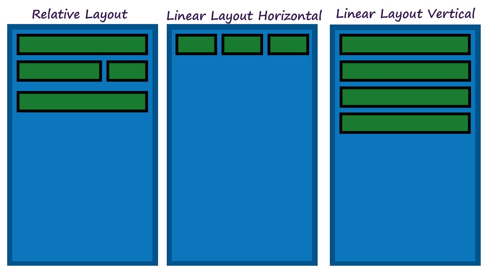

# Layout pada Android



Layout adalah suatu tampilan tata letak di android studio untuk mengatur penempatan text/gambar yang sudah terkonsep. Jadi layout di sini adalah bagian terpenting untuk memperindah tampilan pada aplikasi yang kita buat nyaman di lihat bagi pengguna.

## Jenis Layout pada Android

Ada 4 jenis layout pada Android Studio : 1. **Relative Layout**

```text
Relative layout adalah layout yang memiliki karakteristik untuk menempatkan komponen secara relatif. Pada layout ini programmer memiliki kebebasan untuk menempatkan komponen yang diinginkan.
```

1. **Linear Layout**

   Linear Layout adalah layout yang menempatkan komponen secara horizontal atau vertical, bergantung pada kode yang digunakan.

2. **Table Layout**

   Table Layout adalah layout yang menempatkan komponen atau mengatur tampilan berdasarkan kolom dan baris.

3. **Frame Layout**

   Frame Layout adalah layout yang menempatkan komponen dengan cara menumpuk komponen-komponen yang ada hingga menutupi komponen yang lain.

**Baca materi selengkapnya di :**

[https://medium.com/@Hendrawanss/jenis-jenis-layout-pada-android-studio-331e21d24872](https://medium.com/@Hendrawanss/jenis-jenis-layout-pada-android-studio-331e21d24872)

