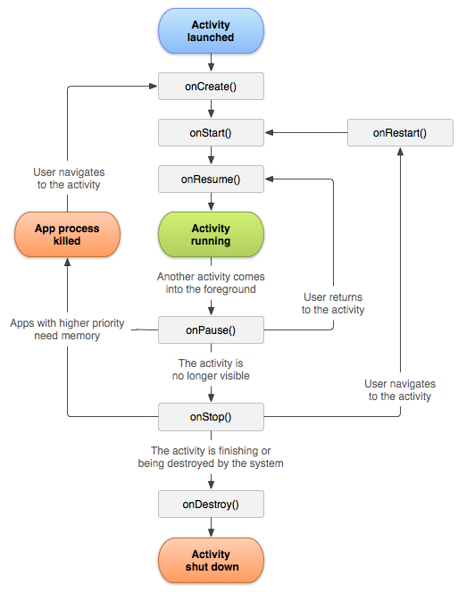

# Activity Lifecycle

Developer yang baik harus mengetahui secara detail tentang _life cycle_ sebuah activity. Terutama untuk melakukan aksi yang tepat, saat terjadi perubahan _state_ activity. _Callback methods_ yang ada dapat digunakan untuk melakukan beragam proses terkait state dari activity. ****Misalnya melakukan semua inisialisasi komponen di `onCreate()`, melakukan _disconnect_ terhadap koneksi ke _server_ pada `onStop()`atau `onDestroy()`dan lain sebagainya.

Pemahaman yang baik tentang daur hidup _activity_ akan membuat implementasi rancangan aplikasi Kamu menjadi lebih baik. Hal ini juga akan meminimalisir terjadinya _error_ /_bug_/_force_ _close_ yang tidak diinginkan.

* `onCreate()` adalah kondisi awal saat _Activity_ baru diciptakan, biasanya dilakukan inisialisasi pada tahapan ini.
* `onStart()` adalah saat _Activity_ dimulai
* `onResume()` adalah saat _Activity_ dibuka kembali, biasanya dieksekusi setelah `onPause()`
* `onPause()` akan dipanggil saat ada _Activity_ lain yang terbuka.
* `onStop()` adalah kondisi saat _Activity_ tidak ditampilkan dilayar \(biasanya saat pengguna menekan tombol Home\).
* `onRestart()` adalah kondisi saat _Activity_ kembali dibuka oleh pengguna.
* `onDestroy()` adalah kondisi saat _Activity_ dihancurkan pada memori.

