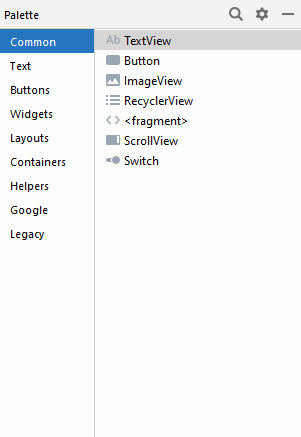
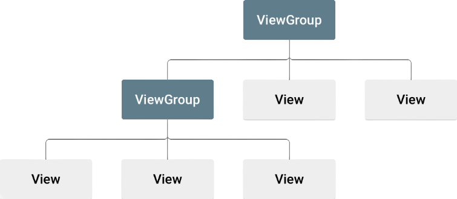

# Komponen View & ViewGroup

Pada dasarnya semua element- element tampilan dalam aplikasi android dibangun dengan menggunakan dua buah komponen utama, yaitu View dan Viewgroup. Dua komponen utama tersebut dapat dilihat pada jendela pallete yang ada pada Android Studio.

### View

**View** merupakan sebuah objek yang dapat menggambarkan komponen - komponen tampilan pada layar yang mana pengguna dapat melihat dan dapat berinteraksi secara langsung. View juga sering disebut sebagai widget dalam aplikasi Android. Contoh dari komponen View adalah sebagai berikut:

* **TextView** : komponen yang berguna untuk menampilkan text.
* **Button** : komponen yang cukup penting dikarenakan dengan komponen ini pengguna dapat berinteraksi serta melakukan sesuatu dengan aplikasi android.
* **ListView** : komponen untuk menampilkan informasi dalam bentuk list.
* **GridView** : komponen untuk menampilkan informasi dalam bentuk grid.
* **RadioButton** : komponen yang memungkinkan pengguna dapat memilih satu pilihan dari berbagai pilihan yang disediakan.
* **Checkbox** : komponen yang memungkinkan pengguna dapat memilih lebih dari satu dari pilihan yang ada.
* **ImageView** : komponen yang berguna untuk menampilkan gambar sehingga tampilan menjadi lebih menarik.
* **RecyclerView** : komponen yang berguna untuk menampilkan data dalam jumlah yang banyak.
* **Plain Text** : komponen yang berguna untuk wadah pengguna memasukkan data.

### ViewGroup

**ViewGroup** merupakan suatu objek yang dapat menampung atau mewadahi objek - objek seperti View ataupun ViewGroup itu sendiri sehingga dapat membentuk suatu kesatuan yang utuh dalam tampilan suatu aplikasi android. Contoh dari komponen ViewGroup adalah sebagai berikut:

* ConstraintLayout
* LinearLayout
* FrameLayout
* TableLayout
* RelativeLayout

Untuk penjelasan mengenai ViewGroup sendiri akan dijelaskan pada materi selanjutnya.

### Hirarki Tampilan

Pada hirarki di atas dapat dilihat jika ViewGroup merupakan root dari tampilan android, yang mana di dalamnya dapat terdiri dari ViewGroup itu sendiri maupun dapat langsung terdiri dari komponen View.

### Atribut

Setiap komponen View dan ViewGroup mendukung ragam atribut XML miliknya sendiri. Beberapa atribut bersifat khusus untuk komponen \(misal, TextView mendukung atribut `textSize` \). Namun ada juga atribut yang bersifat umum untuk semua komponen \(seperti atribut `id`, `width`, `height`\). 

