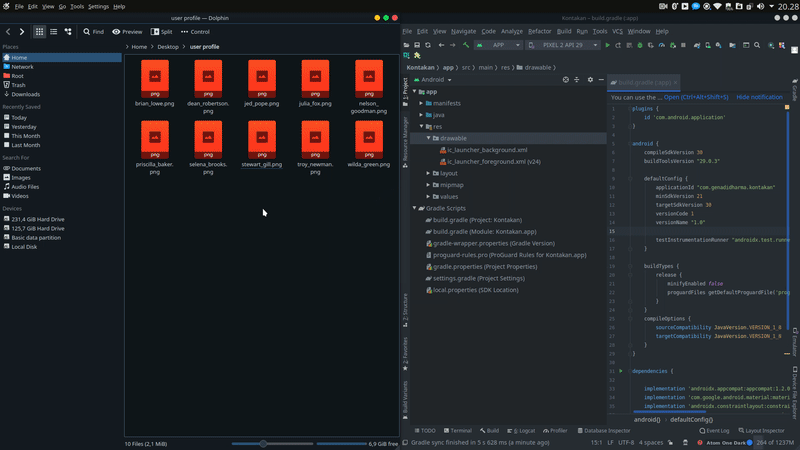
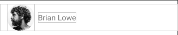
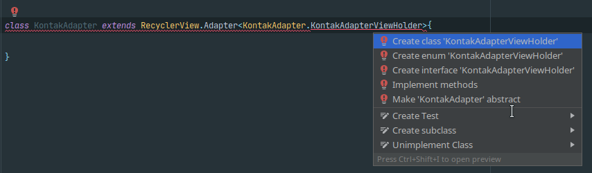
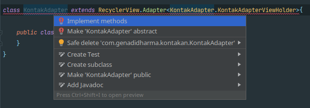
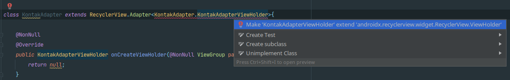
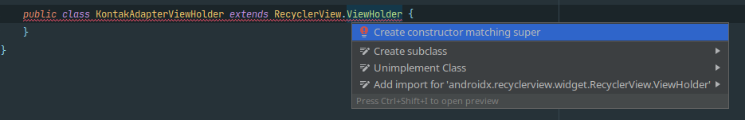
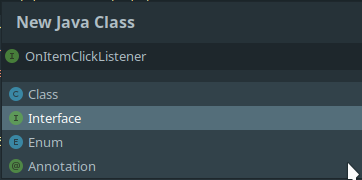
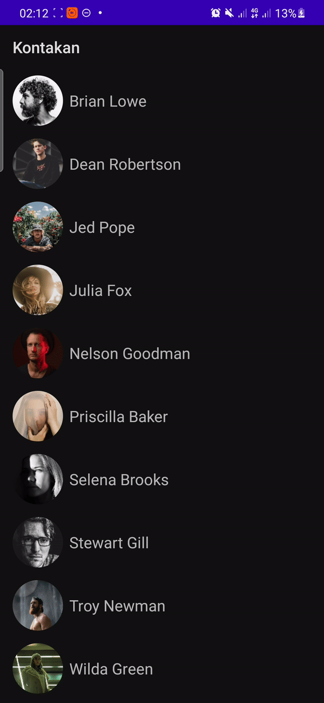

# Praktik Model List Pada RecyclerView


## Aplikasi Kontak

Aplikasi kontak yang merupakan aplikasi _default_ yang harus ada di HP Androidmu merupakan salah satu aplikasi yang menerapkan RecyclerView sederhana untuk menampilkan _list-list_ kontak. Kali ini, Kamu akan mencoba untuk membuat aplikasi serupa yang menampilkan data-data kontak statis dan detail kontak tersebut seperti contoh di bawah:

### Alur

Sama seperti aplikasi kontak pada umumnya, ketika membuka aplikasi, kamu akan disuguhkan _list_ kontak, dan ketika mengklik salah satunya, kamu akan diarahkan ke halaman detail kontaknya.

### Logika Dasar

* Membuka aplikasi yang menampilkan Activity berisi RecyclerView yang menampung _list_ data kontak.
* Mengirim data dengan Intent Explicit ke Activity detail ketika mengklik salah satu data kontak.
* Menampilkan data detail kontak pada Activity detail.

## Koding Aplikasi Kontak

### Persiapan

Buatlah _project_ baru pada Android Studio dengan ketentuan berikut

| Kategori | Pilihan |
| :--- | :--- |
| Nama Project | Kontakan\(Opsional\) |
| Jenis Activity | Empty Activity |
| Language | Java |
| Minimum SDK | API 21: Android 5.0\(Lollipop\) |

### Resource

_Download_ terlebih dahulu _resource_ dibawah ini untuk bisa lanjut ke langkah berikutnya

* [Gambar Foto Profil dan Icon](https://drive.google.com/uc?id=1lKOYw7RIpTPfnYsffWTC9dGARVfAv0ad&export=download)_._
* \(Opsional\) [_Repository_ Starter Project](https://github.com/wrideveloper/kontakan).

### Menambahkan Library

Mantap, setelah _project_ sudah berhasil _build_. Bukalah _file_ `build.gradle(Module:app)`


tambahkan beberapa _library_ berikut pada blok `dependencies`:

```java
implementation 'androidx.recyclerview:recyclerview:1.2.0'
implementation 'androidx.cardview:cardview:1.0.0'
implementation 'de.hdodenhof:circleimageview:3.1.0'
implementation 'com.github.bumptech.glide:glide:4.11.0'
```

Sehingga _file_ `build.gradle(Module:app)` menjadi:

```java
plugins {
    id 'com.android.application'
}

android {
    compileSdkVersion 30
    buildToolsVersion "29.0.3"

    defaultConfig {
        applicationId "com.genadidharma.kontakan"
        minSdkVersion 21
        targetSdkVersion 30
        versionCode 1
        versionName "1.0"

        testInstrumentationRunner "androidx.test.runner.AndroidJUnitRunner"
    }

    buildTypes {
        release {
            minifyEnabled false
            proguardFiles getDefaultProguardFile('proguard-android-optimize.txt'), 'proguard-rules.pro'
        }
    }
    compileOptions {
        sourceCompatibility JavaVersion.VERSION_1_8
        targetCompatibility JavaVersion.VERSION_1_8
    }
}

dependencies {

    implementation 'androidx.appcompat:appcompat:1.2.0'
    implementation 'com.google.android.material:material:1.3.0'
    implementation 'androidx.constraintlayout:constraintlayout:2.0.4'
    implementation 'androidx.recyclerview:recyclerview:1.2.0'
    implementation 'androidx.cardview:cardview:1.0.0'
    implementation 'de.hdodenhof:circleimageview:3.1.0'
    implementation 'com.github.bumptech.glide:glide:4.11.0'
    testImplementation 'junit:junit:4.+'
    androidTestImplementation 'androidx.test.ext:junit:1.1.2'
    androidTestImplementation 'androidx.test.espresso:espresso-core:3.3.0'
}
```

terakhir, klik tombol **Sync Now** yang ada di pojok kanan atas.

**Penjelasan:**

* Ketika kamu ingin mempercepat dan mempermudah proses pembuatan aplikasi, kamu bisa memanfaatkan berbagai macam Library yang disediakan oleh _developer_ di berbagai komunitas Android.
* Contohnya, untuk membuat agar komponen ImageView di XMLmu bisa berbentuk lingkaran, kamu perlu membuat _custom layout_ sendiri. Oleh karena itu, ada Library CircleImageView yang bisa langsung digunakan apabila Kamu perlu untuk menampilkan komponen ImageView berbentuk lingkaran
* Untuk menambahkannya, Kamu tinggal menambahkan pada blok `dependencies` pada _file_ `build.gradle(Module:app)`.

### Exporting & Creating Resource

Karena data-data yang akan ditampilkan adalah data statis atau _dummy_. Maka, terlebih dahulu Kamu harus menyiapkan atribut-atribut setiap data yang terdiri dari:

* Foto Kontak
* Nama Kontak
* Nomor Kontak
* Email Kontak


Jika kamu sudah familiar dengan Git, kamu bisa melewati langkah ini dan melakukan _clone_ pada [_starter project_](https://github.com/wrideveloper/kontakan/tree/main) dan lanjut untuk [Membuat Layout RecyclerView dan Item Layout](layout-pada-recyclerview.md#membuat-layout-recyclerview-dan-item-layout)


#### Export Foto Kontak

Kamu bisa menyiapkan sendiri foto-foto kontak sesuai keinginanmu dan dengan jumlah berapapun, atau Kamu juga bisa menggunakan foto kontak yang sudah disiapkan dalam bentuk .zip pada _link_ [berikut](https://drive.google.com/uc?id=1lKOYw7RIpTPfnYsffWTC9dGARVfAv0ad&export=download). Jangan lupa juga untuk meng-_extract file_ tersebut sebelum melakukan _export_ ke Android Studio.

_Copy_ seluruh _file_ foto dan _paste_ pada folder **res → drawable** pada Android Studiomu.



#### Membuat Dummy Data Resource

Sekarang, saatnya untuk membuat sebuah objek yang di dalamnya terdapat atribut-atribut kontak yang sudah dijelaskan sebelumnya. Buatlah _class_ Java baru bernama **Kontak** dengan melakukan **klik kanan pada nama** _**package**_ **→ New → Java Class.**


dan tambahkan kode berikut:

```java
public class Kontak {
   //TODO 1: Mendeklarasikan atribut-atribut pada Objek Kontak
   /*
   foto: int
   nama: String
   noTelepon: String
   email: String
   */
    private @DrawableRes int foto;
    private String nama;
    private String noTelepon;
    private String email;
}
```

Lalu, **Klik kanan → Generate.. →klik Getter and Setter**


Pilih semua variabel yang sudah dibuat dengan **menekan `ctrl + A` pada** _**keyboard**_ **→Klik OK.**

Getter & Setter akan ter_-generate_ secara otomatis seperti kodingan berikut:

```java
package com.genadidharma.kontakan;

import androidx.annotation.DrawableRes;

public class Kontak {
    //TODO 1: Mendeklarasikan atribut-atribut pada Objek Kontak
    /*
    foto: int
    nama: String
    noTelepon: String
    email: String
    */
    private @DrawableRes int foto;
    private String nama;
    private String noTelepon;
    private String email;

    //TODO 2: Membuat Getter & Setter
    /*
    Getter: Method untuk mengambil data dari sebuah objek
    Setter: Method untuk mengisi data sebuah objek
    */
    public int getFoto() {
        return foto;
    }

    public void setFoto(int foto) {
        this.foto = foto;
    }

    public String getNama() {
        return nama;
    }

    public void setNama(String nama) {
        this.nama = nama;
    }

    public String getNoTelepon() {
        return noTelepon;
    }

    public void setNoTelepon(String noTelepon) {
        this.noTelepon = noTelepon;
    }

    public String getEmail() {
        return email;
    }

    public void setEmail(String email) {
        this.email = email;
    }
}

```

**Penjelasan:**

* Kontak direpresentasikan dalam sebuah Objek yang memiliki atribut foto, nama, nomor telepon, dan email.
* Untuk bisa memberikan nilai setiap atribut dalam sebuah Objek, digunakan metode `setter()`
* Sedangkan, untuk bisa mengambil nilai setiap atribut dalam sebuah Objek, digunakan metode `getter()`.

Buatlah _class_ Java baru lagi bernama `KontakData` untuk membuat _dummy_ data dari objek `Kontak` dengan **klik kanan pada nama** _**package**_ **→ New → Java Class** dan tambahkan kode di bawah ini.

```java
package com.genadidharma.kontakan;

import java.util.ArrayList;
import java.util.List;

public class KontakData {
    //TODO 3: Membuat 10 data untuk mengisi atribut
    /*
    Masing-masing atribut(foto, nama, noTelepon, email) harus diinisalisasikan datanya terlebih dahulu
    menggunakan Array masing-masing sebanyak 10.
    */
    private static final int[] foto = {
            R.drawable.brian_lowe,
            R.drawable.dean_robertson,
            R.drawable.jed_pope,
            R.drawable.julia_fox,
            R.drawable.nelson_goodman,
            R.drawable.priscilla_baker,
            R.drawable.selena_brooks,
            R.drawable.stewart_gill,
            R.drawable.troy_newman,
            R.drawable.wilda_green
    };

    private static final String[] nama = {
            "Brian Lowe",
            "Dean Robertson",
            "Jed Pope",
            "Julia Fox",
            "Nelson Goodman",
            "Priscilla Baker",
            "Selena Brooks",
            "Stewart Gill",
            "Troy Newman",
            "Wilda Green"
    };

    private static final String[] noTelepon = {
            "+62 827-314-390",
            "+62 885-7245-79170",
            "+62 818-937-619",
            "+62 877-1881-2746",
            "+62 829-5160-65544",
            "+62 839-191-933",
            "+62 832-995-456",
            "+62 860-1391-90978",
            "+62 819-8485-242",
            "+62 892-0499-694"
    };

    private static String[] email = {
            "brianlowe@gmail.com",
            "deanrobertson@gmail.com",
            "jedpope@gmail.com",
            "juliafox@gmail.com",
            "nelsongoodman@gmail.com",
            "priscillabaker@gmail.com",
            "selenabrooks@gmail.com",
            "stewartgill@gmail.com",
            "troynewman@gmail.com",
            "wildagreen@gmail.com"
    };

    // TODO 4: Membuat method untuk membuat objek kontak dan menyimpan ke dalam List
    // Method mengembalikan nilai bertipe List<Kontak>
    public static List<Kontak> getKontakData(){
        // Mendeklarasikan varibel ArrayList berjenis Kontak
        ArrayList<Kontak> listKontak = new ArrayList<>();
        // Melakukan perulangan sebanyak jumlah data(10 kali)
        for (int i = 0; i < nama.length; i++) {
            // Membuat objek Kontak
            Kontak kontak = new Kontak();
            // Mengisi data setiap atribut menggunakan setter()
            kontak.setFoto(foto[i]);
            kontak.setNama(nama[i]);
            kontak.setNoTelepon(noTelepon[i]);
            kontak.setEmail(email[i]);

            // Menambahkan objek kontak ke dalam ArrayList Kontak
            listKontak.add(kontak);
        }
        // Mengembalikan nilai ArrayList Kontak
        return listKontak;
    }
}

```

**Penjelasan:**

* Data yang akan ditampilkan berjumlah 10 Objek Kontak.
* Sebelum membuat Objek Kontak, terlebih dahulu diinisialisasikan variabel-variabel sesuai atribut Kontak bertipe _array_ masing-masing berisi 10 data.
* _Method_ `getKontakData()` digunakan untuk membuat 10 Objek Kontak tersebut. Dengan melakukan perulangan, membuat Objek Kontak dengan kata kunci `new`, dan mengisi setiap atribut kontak dengan `setter()`.
* Setiap objek disimpan dalam sebuah `ArrayList`, yaitu sebuah _array_ yang dapat menyimpan data-data berbentuk Objek.

### Membuat Layout RecyclerView dan Item Layout

Bukalah _file_ `activity_main.xml` yang terdapat pada **res → layout**, tambahkan kode berikut untuk membuat _layout_ RecyclerViewnya.

```markup
<?xml version="1.0" encoding="utf-8"?>

<!--TODO 5: Membuat Layout RecyclerView-->

<androidx.constraintlayout.widget.ConstraintLayout xmlns:android="http://schemas.android.com/apk/res/android"
    xmlns:app="http://schemas.android.com/apk/res-auto"
    xmlns:tools="http://schemas.android.com/tools"
    android:layout_width="match_parent"
    android:layout_height="match_parent"
    tools:context=".MainActivity">

    <androidx.recyclerview.widget.RecyclerView
        android:id="@+id/rv_kontak"
        android:layout_width="match_parent"
        android:layout_height="match_parent"
        app:layout_constraintBottom_toBottomOf="parent"
        app:layout_constraintEnd_toEndOf="parent"
        app:layout_constraintStart_toStartOf="parent"
        app:layout_constraintTop_toTopOf="parent" />
</androidx.constraintlayout.widget.ConstraintLayout>
```

Selanjutnya, Kamu perlu untuk membuat sebuah _layout_ .xml baru untuk setiap _item_ kontaknya. Pergilah ke **res → klik kanan pada layout → New → Layout Resource File**, beri nama `item_list`, dan tulislah kode berikut.

```markup
<?xml version="1.0" encoding="utf-8"?>

<!--TODO 6: Membuat Layout Item Layout-->
<!--Menggunakan Library CircleImageView yang sudah ditulis pada  build.gradle(Module:app)-->

<androidx.constraintlayout.widget.ConstraintLayout xmlns:android="http://schemas.android.com/apk/res/android"
    xmlns:app="http://schemas.android.com/apk/res-auto"
    xmlns:tools="http://schemas.android.com/tools"
    android:layout_width="match_parent"
    android:layout_height="wrap_content"
    android:layout_marginTop="8dp"
    android:layout_marginBottom="8dp"
    android:background="?android:attr/selectableItemBackground"
    android:clickable="true"
    android:focusable="true"
    android:paddingStart="16dp"
    android:paddingEnd="16dp">

    <de.hdodenhof.circleimageview.CircleImageView
        android:id="@+id/ci_foto"
        android:layout_width="64dp"
        android:layout_height="64dp"
        app:layout_constraintStart_toStartOf="parent"
        app:layout_constraintTop_toTopOf="parent"
        tools:src="@drawable/brian_lowe" />

    <TextView
        android:id="@+id/tv_nama"
        android:layout_width="wrap_content"
        android:layout_height="wrap_content"
        android:layout_marginStart="8dp"
        android:fontFamily="sans-serif"
        android:textAppearance="@style/TextAppearance.AppCompat.Medium"
        app:layout_constraintBottom_toBottomOf="@+id/ci_foto"
        app:layout_constraintStart_toEndOf="@+id/ci_foto"
        app:layout_constraintTop_toTopOf="@+id/ci_foto"
        tools:text="Brian Lowe" />

</androidx.constraintlayout.widget.ConstraintLayout>
```


Jangan lupa untuk memberikan _id_ untuk setiap komponennya ya.


_Preview_ daru _layout_ XML di atas akan seperti:



### Membuat Adapter RecyclerView

Untuk bisa mengisi data pada RecyclerView, terlebih dahulu Kamu harus membuat sebuah Adapter. Adapter bertindak sebagai jembatan yang menghubungkan antara _data source_, yaitu _dummy data_ kontak yang sudah dibuat dan juga UI Component, yaitu _item layout_ yang juga sudah dibuat.

Untuk membuat sebuah Adapter, buatlah _class_ Java baru lagi bernama `KontakAdapter` dengan **klik kanan pada nama** _**package**_ **→ New → Java Class** dan tambahkan kode di bawah ini.

```java
package com.genadidharma.kontakan;

import androidx.recyclerview.widget.RecyclerView;

// TODO 7: Membuat class Adapter yang meng-extends class RecyclerView.Adapter
/*
RecylerView.Adapter merupakan sebuah abstract class yang di dalamnya berisi berbagai method untuk
membuat sebuah RecyclerView
*/
public class KontakAdapter extends RecyclerView.Adapter<KontakAdapter.KontakAdapterViewHolder>(){

}
```

Jangan khawatir apabila Kamu mendapatkan _error_, karena _class_ `KontakAdapter` meng-_extends_ sebuah  _class_ ViewHolder yang digunakan untuk memuat data nantinya, dan _class_ tersebut belum didefiniskan. Kamu bisa mengarahkan kursor dan klik tulisan KontakAdapterViewHolder, lalu menekan tombol **`alt+enter`** pada _keyboard_-mu dan memilih pilihan pertama untuk membuat _inner_ _class_ `KontakAdapterViewHolder` seperti gambar di bawah.



Sehingga kodingan menjadi seperti berikut.

```java
package com.genadidharma.kontakan;

import androidx.recyclerview.widget.RecyclerView;

class KontakAdapter extends RecyclerView.Adapter<KontakAdapter.KontakAdapterViewHolder>{

    // TODO 8: Membuat Inner Class KontakAdapterViewHolder yang meng-extends class RecyclerView.ViewHolder
    // ViewHolder berfungsi untuk mengisi komponen pada item_layout.xml dengan data-data Kontak
    public class KontakAdapterViewHolder {
    }
}

```

Jangan khawatir kalau masih ada _error._ Sekarang, arahkan kursor dan klik pada tulisan KontakAdapter dan tekan lagi `alt+enter` pada _keybord**,**_ pilih lagi pilihan pertama seperti gambar di bawah.




Apabila terdapat _error_ yang disebabkan oleh sintaks **`@org.jetbrains.annotations.NotNull`**, maka hapuslah sintaks tersebut.


Akan ada sebuah _error_ lagi, arahkan kursor dan klik pada tulisan KontakAdapter dan tekan lagi `alt+enter` pada _keybord**,**_ pilih lagi pilihan pertama seperti gambar di bawah.



Akan ada _error_ sekali lagi, arahkan kursor dan klik pada tulisan KontakAdapter dan tekan lagi `alt+enter` pada _keybord**,**_ pilih lagi pilihan pertama seperti gambar di bawah.



Sehingga kode pada `KontakAdapter` menjadi seperti di bawah.

```java
package com.genadidharma.kontakan;

import android.view.View;
import android.view.ViewGroup;

import androidx.annotation.NonNull;
import androidx.recyclerview.widget.RecyclerView;

class KontakAdapter extends RecyclerView.Adapter<KontakAdapter.KontakAdapterViewHolder> {

    // TODO 9: Mengimplementasikan 3 method utama dari class RecyclerView.Adapter
    /*
    onCreateViewHolder() = Berfungsi untuk menginisialisasikan file layout, yaitu item_list.xml ke dalam Adapter
    onBindViewHolder() = Digunakan untuk mengirimkan data Kontak ke dalam ViewHolder
    getItemCount() = Mengambil jumlah data dalam RecyclerView
    */
    
    @NonNull
    @Override
    public KontakAdapterViewHolder onCreateViewHolder(@NonNull ViewGroup parent, int viewType) {
        return null;
    }

    @Override
    public void onBindViewHolder(@NonNull KontakAdapter.KontakAdapterViewHolder holder, int position) {

    }

    @Override
    public int getItemCount() {
        return 0;
    }

    public class KontakAdapterViewHolder extends RecyclerView.ViewHolder {
        public KontakAdapterViewHolder(@NonNull View itemView) {
            super(itemView);
        }
    }
}

```

#### Membuat Interface OnClickListener

Buatlah sebuah _file_ Interface baru bernama `OnItemClickListener` dengan cara **klik kanan pada nama** _**package**_ **→ New → Java Class → Interface.** seperti gambar di bawah.



Lalu, tambahkan kode berikut.

```java
package com.genadidharma.kontakan;

// TODO 10: Membuat Interface OnItemClickListener
// Interface ini berfungsi untuk mengambil data Kontak untuk nantinya dikirim ke Activity Detail 
public interface OnItemClickListener {
    // Membuat method onItemClick yang parameternya berisi objek Kontak
    void onItemClick(Kontak kontak);
}

```

**Penjelasan:**

* Interface `OnItemClickListener` berfungsi untuk mengambil data Kontak untuk nantinya dikirim ke Activity Detail.

Kembali ke _file_ `KontakAdapter.java`, tambahkan beberapa kode berikut untuk melengkapi Adapter.

```java
package com.genadidharma.kontakan;

import android.view.LayoutInflater;
import android.view.View;
import android.view.ViewGroup;
import android.widget.TextView;

import androidx.annotation.NonNull;
import androidx.recyclerview.widget.RecyclerView;

import com.bumptech.glide.Glide;
import com.bumptech.glide.request.RequestOptions;

import java.util.List;

import de.hdodenhof.circleimageview.CircleImageView;

// TODO 7: Membuat class Adapter yang meng-extends class RecyclerView.Adapter
/*
RecylerView.Adapter merupakan sebuah abstract class yang di dalamnya berisi berbagai method untuk
membuat sebuah RecyclerView
*/

class KontakAdapter extends RecyclerView.Adapter<KontakAdapter.KontakAdapterViewHolder> {
    // TODO 11: Membuat atribut yang menyimpan List Kontak dan OnItemClickListener pada class KontakAdapter
    /*
    listKontak: List<Kontak>
    itemClikcListener: OnItemClickListener
    */
    private final List<Kontak> listKontak;
    private final OnItemClickListener itemClickListener;

    // TODO 12: Membuat Konstruktor untuk mengisi atribut
    public KontakAdapter(List<Kontak> listKontak, OnItemClickListener itemClickListener) {
        this.listKontak = listKontak;
        this.itemClickListener = itemClickListener;
    }

    // TODO 9: Mengimplementasikan 3 method utama dari class RecyclerView.Adapter
    /*
    onCreateViewHolder() = Berfungsi untuk menginisialisasikan file layout, yaitu item_list.xml ke dalam Adapter
    onBindViewHolder() = Digunakan untuk mengirimkan data Kontak ke dalam ViewHolder
    getItemCount() = Mengambil jumlah data dalam RecyclerView
    */

    @NonNull
    @Override
    public KontakAdapterViewHolder onCreateViewHolder(@NonNull ViewGroup parent, int viewType)  {
        View view = LayoutInflater.from(parent.getContext()).inflate(R.layout.item_list, parent, false);
        return new KontakAdapterViewHolder(view);
    }

    @Override
    public void onBindViewHolder(@NonNull KontakAdapter.KontakAdapterViewHolder holder, int position) {
        holder.bindItem(listKontak.get(position), itemClickListener);
    }

    @Override
    public int getItemCount() {
        return listKontak.size();
    }

    // TODO 8: Membuat Inner Class KontakAdapterViewHolder yang meng-extends class RecyclerView.ViewHolder
    // ViewHolder berfungsi untuk melakukan binding terhadap komponen di item_layout.xml dengan data Kontak
    public class KontakAdapterViewHolder extends RecyclerView.ViewHolder {
        public KontakAdapterViewHolder(@NonNull View itemView) {
            super(itemView);
        }

        // Membuat method untuk melakukan binding data Kontak ke item_layout
        private void bindItem(Kontak kontak, OnItemClickListener itemClickListener) {
            // Mendeklarasikan komponen foto dan nama dan melakukan Binding
            CircleImageView ciFoto = itemView.findViewById(R.id.ci_foto);
            TextView tvNama = itemView.findViewById(R.id.tv_nama);

            // Memasukan data foto ke dalam komponen foto menggunakan library Glide 
            Glide
                    .with(itemView.getContext())
                    .load(kontak.getFoto())
                    .apply(new RequestOptions())
                    .override(100, 100)
                    .into(ciFoto);
            // Memasukan data nama ke dalam komponen nama.
            tvNama.setText(kontak.getNama());

            //Ketika item diklik, panggil event setOnClickListener
            itemView.setOnClickListener(new View.OnClickListener() {
                @Override
                public void onClick(View v) {
                    // Panggil method onItemClick dari Inteface OnItemClickListener, lalu kirimkan data Kontak ke parameternya
                    itemClickListener.onItemClick(kontak);
                }
            });
        }
    }
}

```

**Penjelasan:**

* Untuk membuat RecyclerView, diperlukan 2 buah _class_ yang meng-extends _class_ `RecyclerView.Adapter` dan RecyclerView.ViewHolder
* _Class_ yang meng-extends `RecyclerView.Adapter` bertujuan untuk mengimplementasikan _method_ untuk membuat RecyclerView yang terdiri dari;
* `onCreateViewHolder()` = Berfungsi untuk menginisialisasikan file layout, yaitu item\_list.xml ke dalam Adapter.
* `onBindViewHolder()` = Digunakan untuk mengirimkan data Kontak ke dalam ViewHolder
* `getItemCount()` = Mengambil jumlah data dalam RecyclerView.
* Sedangkan _class_ yang meng-extends RecyclerView.ViewHolder bertujuan untuk melakukan _binding_ terhadap komponen di `item_layout.xml` dengan data Kontak.

### Mengimplementasikan Adapter pada RecyclerView

Adapter sudah berhasil dibuat, sekarang saatnya untuk mengimplementasikannya ke dalam RecyclerView yang sudah dibuat. Bukalah _file_ `MainActivity.java,` dan tuliskan kode di bawah ini.

```java
package com.genadidharma.kontakan;

import android.content.Intent;
import android.os.Bundle;
import android.os.Parcelable;

import androidx.appcompat.app.AppCompatActivity;
import androidx.recyclerview.widget.LinearLayoutManager;
import androidx.recyclerview.widget.RecyclerView;

import java.util.List;

// TODO 14: Mengimplementasikan Adapter pada RecyclerView
/*
Beberapa langkah yang dilakukan:
- Melakukan binding terhadap komponen RecyclerView dari activity_main.xml
- Menginisialisaikan variabel listKontak dan memanggil method getKontakData dari class KontakData untuk mengambil data Kontak
- Menentukan LayoutManager
- Menginstansiasi Adapter yang sudah dibuat, dengan mengirimkan data listKontak dan mengimplementasikan OnItemClickListener untuk kebutuhan mengirim data nantinya
- Memasang Adapter ke RecyclerView
*/
public class MainActivity extends AppCompatActivity {

    // TODO 15: Mendeklarasikan variabel bertipe objek RecyclerView untuk di binding nantinya
    private RecyclerView rvKontak;

    // TODO 16: Menginisialisasikan variabel bertipe objek List<Kontak> dan menmanggil method getKontakData() dari class KontakData untuk mengambil Data Kontaknya. 
    private final List<Kontak> lisKontak = KontakData.getKontakData();

    @Override
    protected void onCreate(Bundle savedInstanceState) {
        super.onCreate(savedInstanceState);
        setContentView(R.layout.activity_main);

        // TODO 18: Memanggil method initLayout
        initLayout();

        // TODO 19:  Menentukan Layout Manager dari RecyclerViewnya. Karen dalam bentuk List, maka bisa menggunakan LinearLayoutManager
        rvKontak.setLayoutManager(new LinearLayoutManager(this));
        
        // TODO 20:  Menginstansiasi Adapter yang sudah dibuat
        // Dilakukan pengiriman data listKontak dan mengimplementasikan OnItemClickListener pada paremeternya.
        KontakAdapter kontakAdapter = new KontakAdapter(lisKontak, new OnItemClickListener() {
            @Override
            public void onItemClick(Kontak kontak) {
            }
        });
        
        // TODO 21: Memasang adapter ke dalam RecyclerView
        rvKontak.setAdapter(kontakAdapter);
    }

    // TODO 17: Melakukan binding terhadap RecyclerView
    private void initLayout(){
        rvKontak = findViewById(R.id.rv_kontak);
    }
}
```

**Penjelasan:**

* Untuk mengimplementasikan RecyclerView, terlebih dahulu Kamu harus membuat instansiasi dari _class_ KontakAdapter. Saat membuat instansiasi, Kamu akan diminta untuk memasukan 2 buah parameter, bertipe `List<Kontak>` dan `OnItemClickListener.`
* Untuk parameter bertipe `List<Kontak>`, kamu harus mengirimkan 10 data kontak dari _method_ `getKontakData()` pada _class_ `KontakData`.
* Sedangkan parameter bertipe OnItemClickListener nantinya digunakan untuk mengirimkan data ke Activity Detail di step selanjutnya.

Sampai sini, coba untuk menjalankan Aplikasi, lihat dan pastikan bahwa data kontak sudah tampil seperti video di bawah.


### Menampilkan Detail Kontak

Okay, sekarang saatnya Kamu untuk mencoba menampilkan detail dari _list_ kontak pada RecyclerView yang sudah berhasil ditampilkan. Disini, karena akan terjadi perpindahan Activity, maka materi tentang Intent akan diimplementasikan. Tidak cukup dengan Intent biasa, karena ada data sebuah kontak yang harus dikirim ke Activity ketika salah satu _item_ kontak ditekan, maka Intent Explicit juga akan diimplementasikan.

#### Membuat Activity DetailKontak

Untuk membuat sebuah Activity Baru, **klik kanan pada nama** _**package**_ **→ New → Activity →EmptyActivity** ,lalu beri nama `DetailKontakActivity`.

#### Membuat Layout pada Activity DetailKontak

Maka akan terbuat 2 buah _file_ baru yang terdiri dari _file_ Java dan _file_ XML. Bukalah _file_ `activity_detail_kontak.xml` dan buatlah _layout_ seperti kode di bawah.

```markup
<?xml version="1.0" encoding="utf-8"?>
<!--TODO 21: Membuat layout Activity Detail-->

<androidx.constraintlayout.widget.ConstraintLayout xmlns:android="http://schemas.android.com/apk/res/android"
    xmlns:app="http://schemas.android.com/apk/res-auto"
    xmlns:tools="http://schemas.android.com/tools"
    android:layout_width="match_parent"
    android:layout_height="match_parent"
    tools:context=".DetailKontakActivity">

    <de.hdodenhof.circleimageview.CircleImageView
        android:id="@+id/ci_foto"
        android:layout_width="96dp"
        android:layout_height="96dp"
        android:layout_marginTop="24dp"
        app:layout_constraintEnd_toEndOf="parent"
        app:layout_constraintStart_toStartOf="parent"
        app:layout_constraintTop_toTopOf="parent"
        tools:src="@drawable/brian_lowe" />

    <TextView
        android:id="@+id/tv_nama"
        android:layout_width="wrap_content"
        android:layout_height="wrap_content"
        android:layout_marginTop="32dp"
        android:textAppearance="@style/TextAppearance.AppCompat.Large"
        app:layout_constraintEnd_toEndOf="@+id/ci_foto"
        app:layout_constraintStart_toStartOf="@+id/ci_foto"
        app:layout_constraintTop_toBottomOf="@+id/ci_foto"
        tools:text="Brian Lowe" />

    <TextView
        android:id="@+id/tv_no_telepon"
        android:layout_width="wrap_content"
        android:layout_height="wrap_content"
        android:layout_marginTop="8dp"
        android:textAppearance="@style/TextAppearance.AppCompat.Medium"
        app:layout_constraintEnd_toEndOf="@+id/tv_nama"
        app:layout_constraintStart_toStartOf="@+id/tv_nama"
        app:layout_constraintTop_toBottomOf="@+id/tv_nama"
        tools:text="+62 831-112-113" />

    <View
        android:id="@+id/divider"
        android:layout_width="409dp"
        android:layout_height="1dp"
        android:layout_marginTop="32dp"
        android:background="?android:attr/listDivider"
        app:layout_constraintEnd_toEndOf="parent"
        app:layout_constraintStart_toStartOf="parent"
        app:layout_constraintTop_toBottomOf="@+id/tv_no_telepon" />

    <ImageView
        android:id="@+id/iv_message"
        android:layout_width="32dp"
        android:layout_height="32dp"
        android:layout_marginTop="32dp"
        android:background="?android:attr/selectableItemBackground"
        android:clickable="true"
        android:focusable="true"
        app:layout_constraintEnd_toStartOf="@+id/divider2"
        app:layout_constraintHorizontal_bias="0.5"
        app:layout_constraintStart_toStartOf="parent"
        app:layout_constraintTop_toBottomOf="@+id/divider"
        app:srcCompat="@drawable/ic_baseline_message_24" />

    <ImageView
        android:id="@+id/iv_email"
        android:layout_width="32dp"
        android:layout_height="32dp"
        android:background="?android:attr/selectableItemBackground"
        android:clickable="true"
        android:focusable="true"
        app:layout_constraintEnd_toStartOf="@+id/divider3"
        app:layout_constraintHorizontal_bias="0.5"
        app:layout_constraintStart_toEndOf="@+id/divider2"
        app:layout_constraintTop_toTopOf="@+id/divider2"
        app:srcCompat="@drawable/ic_baseline_email_24" />

    <ImageView
        android:id="@+id/iv_duo"
        android:layout_width="32dp"
        android:layout_height="32dp"
        android:background="?android:attr/selectableItemBackground"
        android:clickable="true"
        android:focusable="true"
        app:layout_constraintEnd_toEndOf="parent"
        app:layout_constraintHorizontal_bias="0.5"
        app:layout_constraintStart_toEndOf="@+id/divider3"
        app:layout_constraintTop_toTopOf="@+id/divider3"
        app:srcCompat="@drawable/ic_baseline_duo_24" />

    <View
        android:id="@+id/divider2"
        android:layout_width="0.8dp"
        android:layout_height="32dp"
        android:background="?android:attr/listDivider"
        app:layout_constraintEnd_toStartOf="@+id/iv_email"
        app:layout_constraintHorizontal_bias="0.5"
        app:layout_constraintStart_toEndOf="@+id/iv_message"
        app:layout_constraintTop_toTopOf="@+id/iv_message" />

    <View
        android:id="@+id/divider3"
        android:layout_width="0.8dp"
        android:layout_height="32dp"
        android:background="?android:attr/listDivider"
        app:layout_constraintEnd_toStartOf="@+id/iv_duo"
        app:layout_constraintHorizontal_bias="0.5"
        app:layout_constraintStart_toEndOf="@+id/iv_email"
        app:layout_constraintTop_toTopOf="@+id/iv_email" />

    <com.google.android.material.floatingactionbutton.FloatingActionButton
        android:id="@+id/floatingActionButton"
        android:layout_width="wrap_content"
        android:layout_height="wrap_content"
        android:layout_marginEnd="16dp"
        android:layout_marginBottom="32dp"
        android:clickable="true"
        app:layout_constraintBottom_toBottomOf="parent"
        app:layout_constraintEnd_toEndOf="parent"
        app:srcCompat="@drawable/ic_baseline_call_24" />

</androidx.constraintlayout.widget.ConstraintLayout>
```

#### Menambahkan Intent dan Mengirim data dari MainActivity

Agar ketika salah satu _item_ kontak diklik maka Activity Detail akan muncul, Kamu harus melakukan Intent Explicit yang akan mengirimkan data nama, nomor telepon, email, dan juga foto pemilik kontak.

Bukalah _file_ `MainActivity.java` . Deklarasikan beberapa variabel _key_ di baris 23 pada kode [ini](layout-pada-recyclerview.md#mengimplementasikan-adapter-pada-recyclerview) dengan menambahkan kode berikut.

```java
// TODO 22: Membuat key untuk setiap data yang akan dikirimkan lewat Intent Explicit
// Tujuannya adalah untuk menghindari typo, karena pada penggunaannya cukup memanggil variabelnya saja.
public static final String EXTRA_KEY_NAMA = "nama";
public static final String EXTRA_KEY_NO_TELEPON = "no_telepon";
public static final String EXTRA_KEY_EMAIL = "email";
public static final String EXTRA_KEY_FOTO = "gambar";
```

 Lalu, di dalam _item click listener_-nya, atau baris 28 pada kode [ini](layout-pada-recyclerview.md#mengimplementasikan-adapter-pada-recyclerview).

```java
// TODO 23: Membuat Intent Explicit dan mengirimkan setiap data pada objek Kontak
// Membuat objek Intent
Intent intent = new Intent(MainActivity.this, DetailKontakActivity.class);
// Mengirimkan data setiap atribut kontak
intent.putExtra(EXTRA_KEY_NAMA, kontak.getNama());
intent.putExtra(EXTRA_KEY_NO_TELEPON, kontak.getNoTelepon());
intent.putExtra(EXTRA_KEY_EMAIL, kontak.getEmail());
intent.putExtra(EXTRA_KEY_FOTO, kontak.getFoto());
// Memulai activity
startActivity(intent);
```

Sehingga `MainActivity.java` menjadi seperti berikut.

```java
package com.genadidharma.kontakan;

import android.content.Intent;
import android.os.Bundle;

import androidx.appcompat.app.AppCompatActivity;
import androidx.recyclerview.widget.LinearLayoutManager;
import androidx.recyclerview.widget.RecyclerView;

import java.util.List;

// TODO 14: Mengimplementasikan Adapter pada RecyclerView
/*
Beberapa langkah yang dilakukan:
- Melakukan binding terhadap komponen RecyclerView dari activity_main.xml
- Menginisialisaikan variabel listKontak dan memanggil method getKontakData dari class KontakData untuk mengambil data Kontak
- Menentukan LayoutManager
- Menginstansiasi Adapter yang sudah dibuat, dengan mengirimkan data listKontak dan mengimplementasikan OnItemClickListener untuk kebutuhan mengirim data nantinya
- Memasang Adapter ke RecyclerView
*/
public class MainActivity extends AppCompatActivity {

    // TODO 22: Membuat key untuk setiap data yang akan dikirimkan lewat Intent Explicit
    // Tujuannya adalah untuk menghindari typo, karena pada penggunaannya cukup memanggil variabelnya saja.
    public static final String EXTRA_KEY_NAMA = "nama";
    public static final String EXTRA_KEY_NO_TELEPON = "no_telepon";
    public static final String EXTRA_KEY_EMAIL = "email";
    public static final String EXTRA_KEY_FOTO = "gambar";

    // TODO 15: Mendeklarasikan variabel bertipe objek RecyclerView untuk di binding nantinya
    private RecyclerView rvKontak;

    // TODO 16: Menginisialisasikan variabel bertipe objek List<Kontak> dan menmanggil method getKontakData() dari class KontakData untuk mengambil Data Kontaknya.
    private final List<Kontak> lisKontak = KontakData.getKontakData();

    @Override
    protected void onCreate(Bundle savedInstanceState) {
        super.onCreate(savedInstanceState);
        setContentView(R.layout.activity_main);

        // TODO 18: Memanggil method initLayout
        initLayout();

        // TODO 19:  Menentukan Layout Manager dari RecyclerViewnya. Karen dalam bentuk List, maka bisa menggunakan LinearLayoutManager
        rvKontak.setLayoutManager(new LinearLayoutManager(this));

        // TODO 20:  Menginstansiasi Adapter yang sudah dibuat
        // Dilakukan pengiriman data listKontak dan mengimplementasikan OnItemClickListener pada paremeternya.
        KontakAdapter kontakAdapter = new KontakAdapter(lisKontak, new OnItemClickListener() {
            @Override
            public void onItemClick(Kontak kontak) {
                // TODO 23: Membuat Intent Explicit dan mengirimkan setiap data pada objek Kontak
                // Membuat objek Intent
                Intent intent = new Intent(MainActivity.this, DetailKontakActivity.class);
                // Mengirimkan data setiap atribut kontak
                intent.putExtra(EXTRA_KEY_NAMA, kontak.getNama());
                intent.putExtra(EXTRA_KEY_NO_TELEPON, kontak.getNoTelepon());
                intent.putExtra(EXTRA_KEY_EMAIL, kontak.getEmail());
                intent.putExtra(EXTRA_KEY_FOTO, kontak.getFoto());
                startActivity(intent);
            }
        });

        // TODO 21: Memasang adapter ke dalam RecyclerView
        rvKontak.setAdapter(kontakAdapter);
    }

    // TODO 17: Melakukan binding terhadap RecyclerView
    private void initLayout(){
        rvKontak = findViewById(R.id.rv_kontak);
    }
}
```

**Penjelasan:**

* Intent dilakukan saat sebuah _item_ Kontak diklik. Untuk bisa melakukannya, Kamu harus menambahkan kode di parameter kedua saat instansiasi Adapter, yaitu `onItemClick()`.
* Kode yang ditambahkan yaitu instansiasi Objek Intent diikuti pemanggilan _method_ `putExtra()` untuk mengirimkan datanya.
* Method `putExtra()` meminta 2 parameter, parameter pertama yaitu _key_. Untuk mencegah salah pemanggilan _key_, maka akan lebih baik apabila _key_-nya dideklarasikan sekali saja dalam sebuah variabel lalu ketika diperlukan, Kamu tinggal memanggil variabel tersebut.
* Parameter kedua meminta nilai yang dikirimkan. Untuk memanggil nilai, bisa menggunakan metode Getter.


Data yang dikirimkan menggunakan Intent Explicit masih dilakukan satu persatu. Sebenarnya kamu bisa mengimplementasikan [Parcelable](https://www.codepolitan.com/menggunakan-parcelable-untuk-pengiriman-data-antar-komponen-di-android-599848cf0f158) agar bisa langsung mengirimkan sebuah objek ke Activity lain.


#### Menampilkan Data pada Activity Detail

Sekarang, saatnya untuk menampilkan data dengan mengambil data-data kiriman Intent Explicit tadi. Bukalah _file_ `DetailKontakActivity.java` dan ubah kodenya menjadi seperti berikut.

```java
package com.genadidharma.kontakan;

import androidx.annotation.DrawableRes;
import androidx.appcompat.app.AppCompatActivity;

import android.os.Bundle;
import android.widget.TextView;

import com.bumptech.glide.Glide;
import com.bumptech.glide.request.RequestOptions;

import de.hdodenhof.circleimageview.CircleImageView;

// TODO 24: Menampilkan data hasil dari Intent Explicit
/*
Beberapa langkah yang dilakukan:
- Melakukan binding terhadap komponen dari activity_detail_main.xml
- Mengambil data dari Intent Explicit dan memasukan ke dalam variabel sesuai atribut pada objek Kontak
- Mengisi data-data ke dalam komponen layout
*/
public class DetailKontakActivity extends AppCompatActivity {
    // TODO 25: Mendeklarasikan data-data yang dikirmkan oleh Intent Explicit
    private String nama;
    private String noTelepon;
    private String email;
    private @DrawableRes int foto;

    // TODO 26: Mendeklarasikan komponen pada activity_detail_kontak.xml
    private CircleImageView ciFoto;
    private TextView tvNama;
    private TextView tvNoTelepon;

    @Override
    protected void onCreate(Bundle savedInstanceState) {
        super.onCreate(savedInstanceState);
        setContentView(R.layout.activity_detail_kontak);

        // TODO 29: Panggil method initLayout
        initLayout();
        // TODO 30: Panggil method getIntentExtra
        getIntentExtra();

        //TODO 31: Mengisi data-data ke dalam komponen layout
        Glide
                .with(getApplicationContext())
                .load(foto)
                .apply(new RequestOptions().override(100, 100))
                .into(ciFoto);
        tvNama.setText(nama);
        tvNoTelepon.setText(noTelepon);
    }

    // TODO 27: Melakukan binding terhadap komponen layout
    private void initLayout(){
        ciFoto = findViewById(R.id.ci_foto);
        tvNama = findViewById(R.id.tv_nama);
        tvNoTelepon = findViewById(R.id.tv_no_telepon);
    }

    // TODO 28: Mengambil semua data kiriman Intent Explicit dan menyimpannya ke variabel
    private void getIntentExtra(){
        // Panggil key yang sudah dibuat pada Mainactivity sesuai tipe data variabel pada atribut Kontak dan
        nama = getIntent().getStringExtra(MainActivity.EXTRA_KEY_NAMA);
        noTelepon = getIntent().getStringExtra(MainActivity.EXTRA_KEY_NO_TELEPON);
        email = getIntent().getStringExtra(MainActivity.EXTRA_KEY_EMAIL);
        foto = getIntent().getIntExtra(MainActivity.EXTRA_KEY_FOTO, 0);
    }
}
```

**Penjelasan:**

* Method `getIntentExtra()` digunakan untuk mengambil data-data dari Intent Explicit.
* Pemanggilan data disesuaikan dengan tipe data pada atribut Kontak. Misalnya nama bertipe data String, maka dipanggillah _method_ `getStringExtra()`.
* Parameter saat mengambil data dari Intent Explicit adalah _key_ bertipe String, yang sudah ditentukan sebelumnya pada Activity `DetailKontakActivity`.

Sip, selesai! Cobalah untuk menjalankan aplikasi sehingga hasilnya menjadi seperti berikut.



Selamat! Akhirnya Kamu berhasil membuat RecyclerView pada Android. Ini merupakah tahap awal yang sangat bagus untuk kamu belajar RecyclerView yang menjadi komponen penting pada Aplikasi Android kedepannya. Tetap semangat belajar terus yaa 🙌 .

## TLDR;

Apabila kamu mengalami kesulitan saat mempraktikan kode-kode di atas, kamu bisa mengeceknya pada _link_ _repository_ Github [ini](https://github.com/wrideveloper/kontakan/tree/solution).

