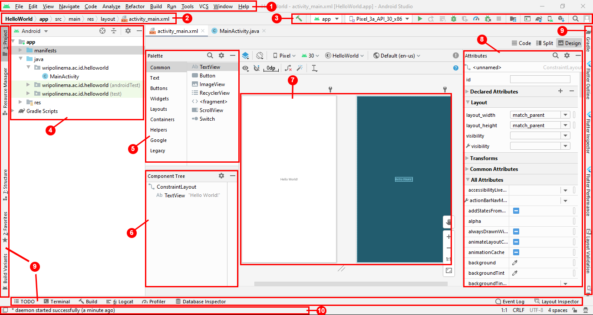
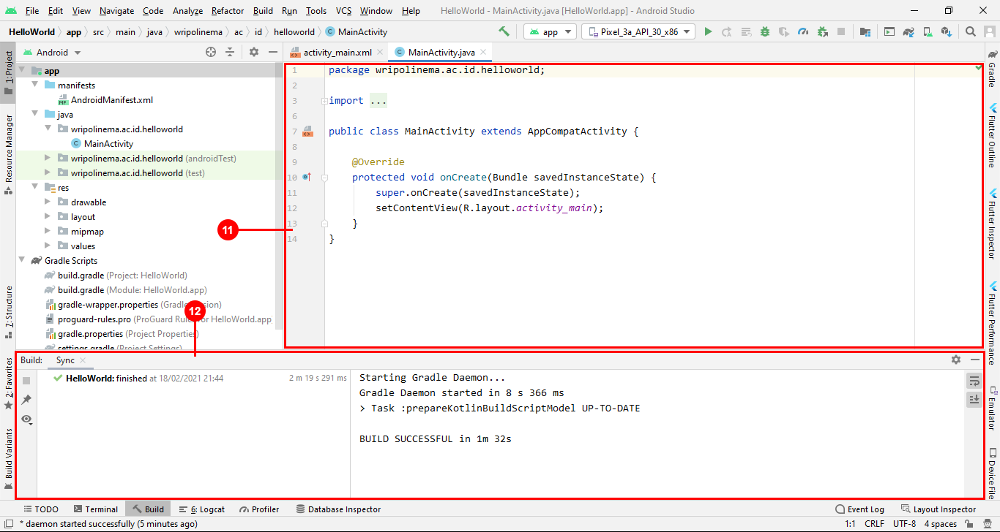

# Tour Android Studio

Android Studio adalah Integrated Development Environment (IDE) resmi untuk pengembangan aplikasi Android, yang didasarkan pada IntelliJ IDEA. Selain sebagai kode editor dan fitur developer IntelliJ yang andal, Android Studio menawarkan banyak fitur yang meningkatkan produktivitas Anda dalam membuat aplikasi Android, seperti:

<ul>
  <li>Sistem build berbasis Gradle yang fleksibel</li>
  <li>Emulator yang cepat dan kaya fitur</li>
  <li>Lingkungan terpadu tempat Anda bisa mengembangkan aplikasi untuk semua perangkat Android</li>
  <li>Terapkan Perubahan untuk melakukan push pada perubahan kode dan resource ke aplikasi yang sedang berjalan tanpa memulai ulang aplikasi</li>
  <li>Template kode dan integrasi GitHub untuk membantu Anda membuat fitur aplikasi umum dan mengimpor kode sampel</li>
  <li>Framework dan alat pengujian yang lengkap</li>
  <li>Dukungan bawaan untuk Google Cloud Platform, yang memudahkan integrasi Google Cloud Messaging dan App Engine</li>
</ul>

## User Interface Android Studio

<ol>
  <li>Menu Bar, berisi perintah dan opsi yang dapat dipilih untuk mengeksekusi suatu perintah.</li>
  <li>Menu Navigasi, membantu Anda menjelajah project dan membuka file untuk diedit. Menu ini memberikan tampilan struktur yang lebih ringkas yang terlihat di jendela Project.</li>
  <li>Toolbar, memungkinkan Anda melakukan berbagai tindakan, termasuk menjalankan aplikasi dan meluncurkan alat Android.</li>
  <li>Struktur Project, menampilkan folder-folder dari sebuah project aplikasi android yang dibuat menggunakan android studio.</li>
  <li>Pallete, menyediakan tools untuk membuat tampilan aplikasi android dengan cara drag & drop.</li>
  <li>Component Tree, menampilkan tools - tools yang sudah dimasukkan ke dalam design aplikasi android.</li>
  <li>Design Android, sebagai tempat mendesign tampilan aplikasi android dengan cara drag & drop.</li>
  <li>Attributes, menampilkan pengaturan - pengaturan dari komponen - komponen yang digunakan dalam design tampilan aplikasi android.</li>
  <li>Panel Jendela Fitur berada di sisi luar jendela IDE dan berisi tombol-tombol yang memungkinkan untuk memperluas atau menciutkan setiap jendela fitur.</li>
  <li>Status Bar, menampilkan status project dan IDE itu sendiri, serta semua peringatan atau pesan.</li>
  <li>Jendela Editor, tempat untuk membuat dan memodifikasi kode.</li>
  <li>Contoh ketika Panel Jendela Fitur diperluas.</li>
</ol>
