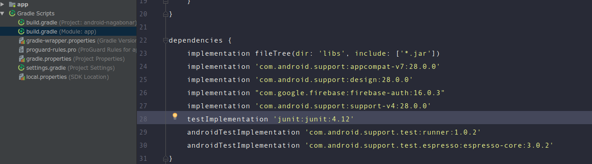

# Dasar Pengenalan Gradle

## Apa sih gradle itu ?
**Gradle** adalah build tools yang digunakan pada Android Studio , untuk mencompile-menjalankan project Aplikasi yang sedang dikembangkan atau konfigurasi yang berada pada bagian Gradle Script

## Gradle sebagai pengelola library
**Library** adalah kumpulan class dan method yang bisa kita gunakan berulang-ulang pada project yang berbeda, tujuannya untuk membantu meringankan pekerjaan coding kita sehingga tidak perlu mengembangkan sebuah fitur dari awal dan mempersingkat development.

Beberapa contoh library pada android development.
 - Android Support Library
 - Picasso
 - Sugar ORM
 - dan masih banyak lagi

Contoh implementasi pengeolaan library pada gradle

Resource untuk library android
 - [Android Arsenal](https://android-arsenal.com/)
 - [Awesome android by Wasabef](https://github.com/wasabeef/awesome-android-libraries)

## Apa sih keuntungan dari gradle itu ?

Banyak sekali yang dapat dilakukan oleh gradle, salah satunya untuk meminimalisir konfigurasi projek dengan banyak modul/library karena mengacu pada satu konfigurasi project.Intinya gradle dapat mengolah banyak library dalam sebuah project.

## Sumber Referensi
- https://developer.android.com/studio/build/?hl=id