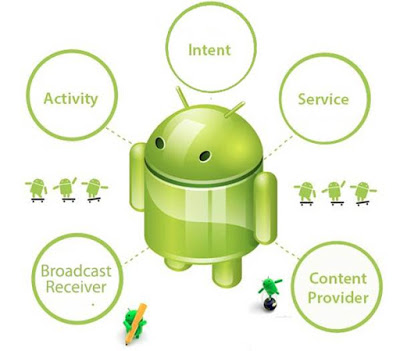

#  Komponen aplikasi android

## Apa saja sih komponen dalam aplikasi android ?

Ada empat komponen utama yang dapat digunakan dalam aplikasi Android :
1. **Activity** 
    - Untuk menampilkan antarmuka aplikasi.
2. **Service** 
    - Untuk menjalankan proses aplikasi di belakang layar.
3. **Broadcast Receiver** 
    - Untuk komunikasi antar activity, aplikasi dan antar device.
4. **Content Provider** 
    - Untuk manajemen data dan database.    
   
    
**Selengkapnya tentang Komponen aplikasi android -** https://www.tutorialspoint.com/android/android_application_components.htm