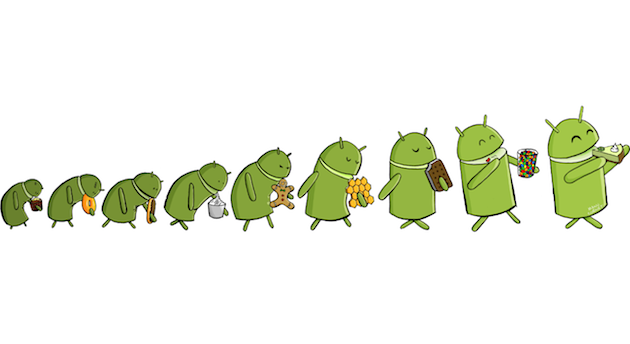

#  Android Evolution

Sebuah sistem pasti mengalami yang nama evolusi atau bisa disebut mengalami perkembangan , begitu juga Android . Namun ada yang berbeda dari penamaan dari Android , Apa yang membuat Android berbeda ? . Android menamai versi dari setiap Android urut dari D hingga sekarang P . Dan , tidak berhenti disitiu setiap alfabet namanya memiliki kepanjangan hidangan penutup

mulai dari D untuk Donut hingga P untuk Pie 

**Selengkapnya tentang Android -** https://www.android.com/history/#/donut
