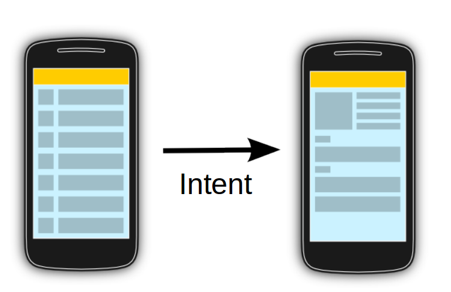

# Intents
## Apa sih intents dalam android itu ?



<center>Image by Vogella</center>

Intent merupakan sebuah objek yang digunakan untuk menghubungkan/berkomunikasi sebuah activity ke activity yang lain.

Intent sendiri di-import melauli paket :
```
android.content.Intent
```

Sample penggunaan
```
Intent i = new Intent(ClassPertama.this, ClassBerikutnya.class);
startActivity(i);
```

## Referensi
- https://developer.android.com/training/basics/firstapp/starting-activity?hl=id
- http://www.vogella.com/tutorials/AndroidIntent/article.html#what-are-intents