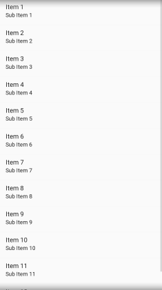

# Menerapkan ListView pada Android Studio
Pada tutorial kali ini, kita akan mengisi Fragment yang telah dibuat pada tutorial sebelumnya dengan ListView.

## Pengertian ListView
ListView adalah View Group yang ditampilkan secara list dan dapat digulung(scrollable). Konten yang terdapat pada ListView, ditambahkan secara automatis menggunakan Adapter yang tugasnya mengambil konten dari beberapa sumber seperti Array atau Database, dan diubah(convert) menjadi ListView secara berurutan.

## Menyiapkan Layout yang digunakan
1. Pada tutorial fragment sebelumnya kita sudah membuat beberapa layout kosong. Sehingga kita akan menggunakan **HomeFragment dan mengisinya dengan listview.**
2. Buka layout **fragment_home.xml** `res/layout/fragment_home.xml` dan isi XML tersebut dengan kode dibawah :
  ```xml
  <?xml version="1.0" encoding="utf-8"?>
<FrameLayout xmlns:android="http://schemas.android.com/apk/res/android"
    xmlns:tools="http://schemas.android.com/tools"
    android:layout_width="match_parent"
    android:layout_height="match_parent"
    tools:context=".HomeFragment">
  
    <ListView
        android:layout_width="match_parent"
        android:layout_height="wrap_content"
        android:id="@+id/listView1"
        />

</FrameLayout>
```
  Elemen `<ListView/>` pada *preview design* akan terlihat seperti gambar dibawah ini : 
  
  
  
3. Selanjutnya, buat XML baru dengan nama `list_layout.xml`, dengan target seperti :


Berikut kode yang dapat diisikan pada XML anda : 
  ```xml
  <?xml version="1.0" encoding="utf-8"?>
<LinearLayout xmlns:android="http://schemas.android.com/apk/res/android"
    xmlns:tools="http://schemas.android.com/tools"
    android:orientation="horizontal"
    android:layout_width="match_parent"
    android:layout_height="wrap_content"
    android:layout_margin="16dp"
    tools:context="com.example.fragmentandlistview.HomeFragment">
    <ImageView
        android:id="@+id/image"
        android:layout_width="90dp"
        android:layout_height="90dp"
        android:src="@drawable/ic_launcher_background"/>
    <LinearLayout
        android:layout_width="match_parent"
        android:layout_height="match_parent"
        android:orientation="vertical"
        android:layout_marginLeft="9dp">
        <TextView
            android:id="@+id/textTitle"
            android:layout_width="match_parent"
            android:layout_height="wrap_content"
            android:text="Items"
            android:textSize="24sp"/>
        <TextView
            android:id="@+id/textDescription"
            android:layout_width="match_parent"
            android:layout_height="fill_parent"
            android:text="Description"
            android:layout_marginRight="12dp"
            android:maxLines="4"
            android:lines="4"
            android:textSize="16sp"/>
    </LinearLayout>
</LinearLayout>
  ```
  
 list_layout ini digunakan sebagai view pada setiap item yang ada di listview, kita daapat menyambungkan tag listView dengan list_layout menggunakan adapter.
 
 ## Menyiapkan data yang akan digunakan
 
 Supaya listview dapat mebuat output berupa text atau gambar, anda harus menentukan tipe data dan nama variabel yang akan digunakan. Untuk menyiapkan data tersebut, kita harus menggunakan POJO. 
 POJO (Plain Old Java Object) adalah sebuah object yang berdiri sendiri tidak memiliki ketergantungan dengan class lain. POJO sering digunakan sebagai model untuk sebuah data tertentu.
 
 1. Buatlah java class baru pada folder `java/com.example.nama_aplikasi/` dengan nama `home.java`, lalu isilah kode seperti dibawah ini:
 ```Java
 package com.example.fragmentandlistview;

public class Home {
    int image;
    String title, desc;

    public Home(int image, String title, String desc){
        this.image = image;
        this.title = title;
        this.desc = desc;
    }

    public int getImage(){
        return image;
    }

    public String getTitle(){
        return title;
    }

    public String getDesc(){
        return desc;
    }
}
 ```
 2. Anda dapat membuat variable sebanyak-banyaknya, selama anda memasukan set dan get pada kode tersebut dan memasukan value sesuai dengan tipe data.
 
 ## Membuat Adapter 
 
  Adapter berfungsi sebagai jembatan antara data dengan view, data dalam bentuk array maupun database akan di convert menjadi object pada yang dapat mengisi listview tersebut.
  1. Buatlah file bernama `HomeListAdapter.java` pada folder `java/com.example.nama_aplikasi/` setelah itu isikan kode dibawah ini :
  ```Java
  package com.example.fragmentandlistview;

import android.content.Context;
import android.support.annotation.NonNull;
import android.support.annotation.Nullable;
import android.view.LayoutInflater;
import android.view.View;
import android.view.ViewGroup;
import android.widget.ArrayAdapter;
import android.widget.Button;
import android.widget.ImageView;
import android.widget.TextView;

import java.util.List;

public class HomeListAdapter extends ArrayAdapter<Home> {
    List<Home> homeList;

    Context context;

    int resource;

    public HomeListAdapter(Context context, int resource, List<Home> homeList){
        super(context, resource, homeList);
        this.context = context;
        this.resource = resource;
        this.homeList = homeList;
    }
    //this will return the ListView Item as a View
    @NonNull
    @Override
    public View getView(final int position, @Nullable View convertView, @NonNull ViewGroup parent) {

        //Get the view of the xml for our list item
        //
        LayoutInflater layoutInflater = LayoutInflater.from(context);

        //getting the view
        //njupuk xml
        View view = layoutInflater.inflate(resource, null, false);

        //getting the view elements of the list from the view
        ImageView imageView = view.findViewById(R.id.image);
        TextView title = view.findViewById(R.id.textTitle);
        TextView desc = view.findViewById(R.id.textDescription);

        //getting the specified position
        Home home = homeList.get(position);

        //adding values to the list item
        imageView.setImageDrawable(context.getResources().getDrawable(home.getImage()));
        title.setText(home.getTitle());
        desc.setText(home.getDesc());

        return view;
    }
}
  ```
  ## Setting up ListView.
  
  1. Pada tahap ini, Anda harus mendeklarasai ArrayList untuk menangkap data yang telah diolah dari adapter.
  2. Buka `HomeFragment.java` untuk mendeklarasikan array list dan adapter yang sudah dibuat, ketiklah kode seperti berikut pada file tersebut :
```Java
  List<Home> homeList;

  ListView listView;
    
  @Override
    public View onCreateView(LayoutInflater inflater, ViewGroup container,
                             Bundle savedInstanceState) {
        View view = inflater.inflate(R.layout.fragment_home, container, false);

        homeList = new ArrayList<>();
        listView = (ListView) view.findViewById(R.id.listView1);

        HomeListAdapter adapter = new HomeListAdapter(getActivity(), R.layout.list_layout, homeList);
        
        return view;
    }
```
  3. Setelah anda mendeklarasi, anda sekarang dapat menambahkan data yang akan dimunculkan pada ListView, berikut kode-nya :
    
```Java
  List<Home> homeList;

  ListView listView;
    
  @Override
    public View onCreateView(LayoutInflater inflater, ViewGroup container,
                             Bundle savedInstanceState) {
        View view = inflater.inflate(R.layout.fragment_home, container, false);

        homeList = new ArrayList<>();
        listView = (ListView) view.findViewById(R.id.listView1);
        
        //untuk menambahkan data baru
        homeList.add(new Home(R.drawable.ic_launcher_background, "Scoot Mark", "It's a nice movie!"));
        homeList.add(new Home(R.drawable.profile_pc, "Sam Dense", "I think she just acting like a catfisher. we should be aware of him"));
        
        HomeListAdapter adapter = new HomeListAdapter(getActivity(), R.layout.list_layout, homeList);
        
        listView.setAdapter(adapter);
        
        return view;
    }
```
  Anda dapat menambahkan data sebanyak apapun selama value dari data tersebut sesuai dengan tipe data yang sudah ditentukan pada file `Home.java`.
  
 ## Final Code
  Setelah anda membuat data model, list adapter, list view pada home fragment. Berikut kode final yang dapat anda sesuaikan pada program anda :
  
  `Home.java`
  ```java
  package com.example.fragmentandlistview;

public class Home {
    int image;
    String title, desc;

    public Home(int image, String title, String desc){
        this.image = image;
        this.title = title;
        this.desc = desc;
    }

    public int getImage(){
        return image;
    }

    public String getTitle(){
        return title;
    }

    public String getDesc(){
        return desc;
    }
}
  ```
  
  
  `HomeListAdapter.java`
  ```Java
  package com.example.fragmentandlistview;

import android.content.Context;
import android.support.annotation.NonNull;
import android.support.annotation.Nullable;
import android.view.LayoutInflater;
import android.view.View;
import android.view.ViewGroup;
import android.widget.ArrayAdapter;
import android.widget.Button;
import android.widget.ImageView;
import android.widget.TextView;

import java.util.List;

public class HomeListAdapter extends ArrayAdapter<Home> {
    List<Home> homeList;

    Context context;

    int resource;

    public HomeListAdapter(Context context, int resource, List<Home> homeList){
        super(context, resource, homeList);
        this.context = context;
        this.resource = resource;
        this.homeList = homeList;
    }
    //this will return the ListView Item as a View
    @NonNull
    @Override
    public View getView(final int position, @Nullable View convertView, @NonNull ViewGroup parent) {

        //Get the view of the xml for our list item
        //
        LayoutInflater layoutInflater = LayoutInflater.from(context);

        //getting the view
        //njupuk xml
        View view = layoutInflater.inflate(resource, null, false);

        //getting the view elements of the list from the view
        ImageView imageView = view.findViewById(R.id.image);
        TextView title = view.findViewById(R.id.textTitle);
        TextView desc = view.findViewById(R.id.textDescription);

        //getting the specified position
        Home home = homeList.get(position);

        //adding values to the list item
        imageView.setImageDrawable(context.getResources().getDrawable(home.getImage()));
        title.setText(home.getTitle());
        desc.setText(home.getDesc());

        return view;
    }
}
  ```
  
  `HomeFragment.java`
  ```Java
  package com.example.fragmentandlistview;


import android.content.Intent;
import android.os.Bundle;
import android.support.v4.app.Fragment;
import android.view.LayoutInflater;
import android.view.View;
import android.view.ViewGroup;
import android.widget.AdapterView;
import android.widget.ArrayAdapter;
import android.widget.ListView;
import android.widget.SimpleAdapter;

import java.util.ArrayList;
import java.util.HashMap;
import java.util.List;


/**
 * A simple {@link Fragment} subclass.
 */
public class HomeFragment extends Fragment {

    List<Home> homeList;

    ListView listView;

    public HomeFragment() {
        // Required empty public constructor
    }

    @Override
    public View onCreateView(LayoutInflater inflater, ViewGroup container,
                             Bundle savedInstanceState) {
        View view = inflater.inflate(R.layout.fragment_home, container, false);

        homeList = new ArrayList<>();
        listView = (ListView) view.findViewById(R.id.listView1);

        homeList.add(new Home(R.drawable.ic_launcher_background, "Scoot Mark", "It's a nice movie!"));
        homeList.add(new Home(R.drawable.profile_pc, "Sam Dense", "I think she just acting like a catfisher. we should be aware of him"));

        HomeListAdapter adapter = new HomeListAdapter(getActivity(), R.layout.list_layout, homeList);

        listView.setAdapter(adapter);

        listView.setOnItemClickListener(new AdapterView.OnItemClickListener() {
            @Override
            public void onItemClick(AdapterView<?> parent, View view, int position, long id) {
                int image =  homeList.get(position).image;
                String title =  homeList.get(position).title;
                System.out.println(image);
                Intent myIntent = new Intent(view.getContext(), DetailActivity.class);
                myIntent.putExtra("image", image);
                myIntent.putExtra("title", title);
                myIntent.putExtra("desc", homeList.get(position).desc);
                startActivityForResult(myIntent, 0);
            }
        });
        return view;
    }

}
  ```
