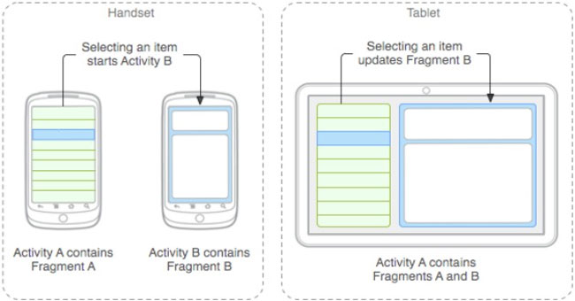

# Android Fragments

## Apa itu Android Fragments ?

Sumber : https://devcfgc.com/two-fragments-in-one-activity-278b5ee45ae9

Fragment merupakan sebuah reuseable class yang mengimplement beberapa fitur sebuah Activity. Fragment dibuat sebagai bagian dari suatu UI. Sebuah fragment harus berada di dalam sebuah activity, mereka tidak dapat berjalan sendiri tanpa adanya activity tempat mereka menempel.

Untuk menciptakan aplikasi dengan layout dinamis kita perlu menggunakan fragment. Fragment merupakan komponen yang dapat digunakan berulang-ulang untuk beberapa aktivitas UI layout. Tujuan dari fragment untuk menciptakan UI layout yang lebih dinamis dan menghindari perpindahan Activity yang berlebihan.

## Kelebihan Fragment
- Dapat menggunakan komponen view dan logic berulang ulang

    Dapat dipakai untuk menampilkan data atau melakukan event tertentu dibeberapa activity berbeda
- Orientasi Layar

    Fragment memungkinkan dua orientasi(portrait/landscape) untuk menggunakan tampilan yang berbeda menggunakan elemen yang sama.

## Contoh implementasi Fragment
- [Implementasi Fragment pada TabView](https://github.com/ffadilaputra/android-nagabonar)
- [Weather Apps](https://github.com/udacity/Sunshine-Version-2)

## Referensi Belajar
- [Advanced Android App Development - Udacity](https://www.udacity.com/course/advanced-android-app-development--ud855)

## Sumber Referensi
- https://developer.android.com/guide/components/fragments
- https://devcfgc.com/two-fragments-in-one-activity-278b5ee45ae9

