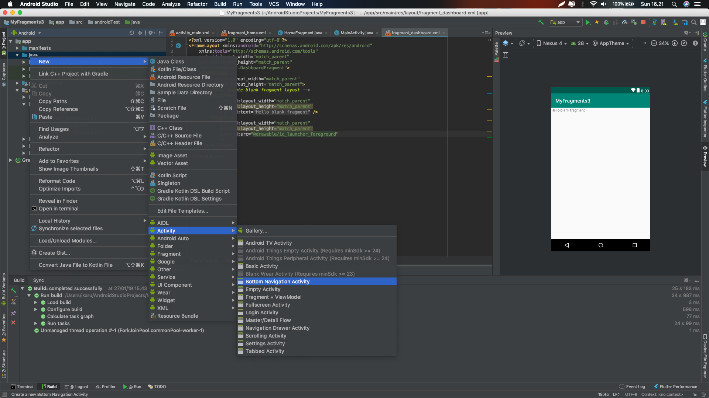
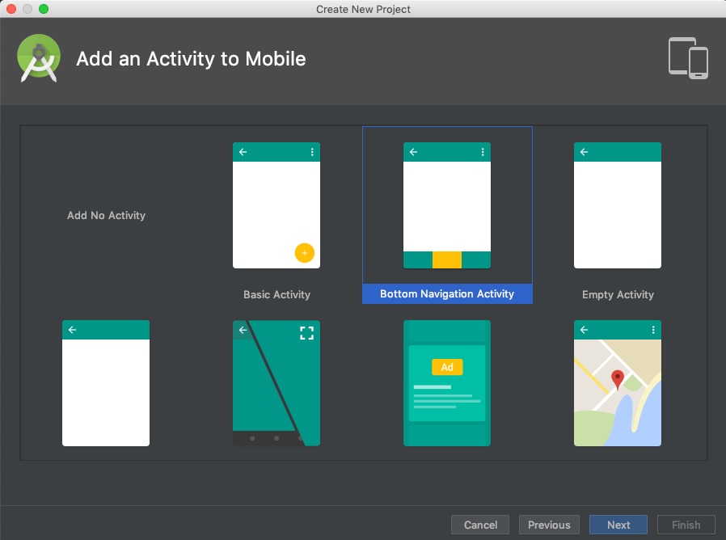
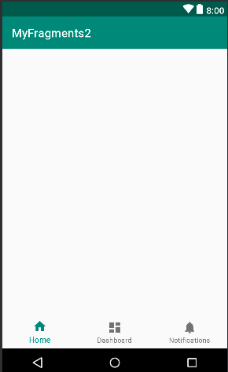
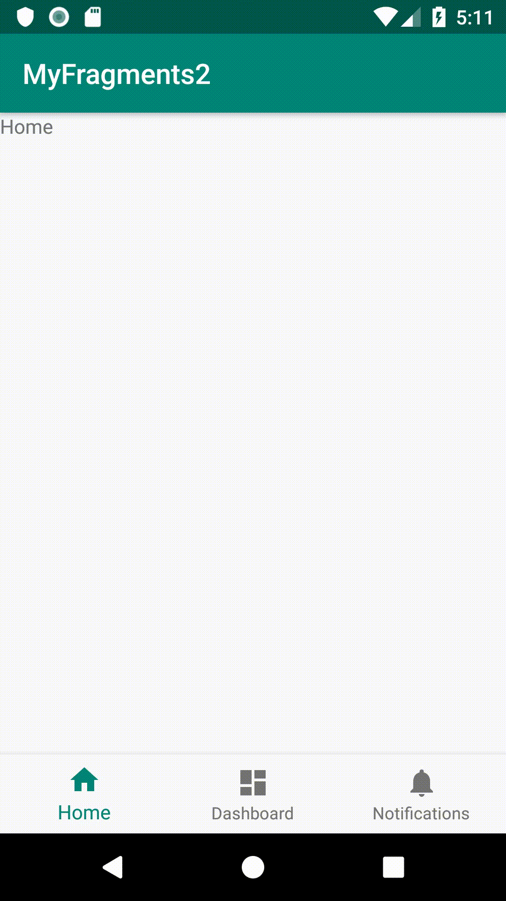

# Fragments Dengan Menggunakan Bottom Navigation

## Menggunakan Bottom Navigation di Android

Sangat mudah menggunakan Bottom Navigation didalam Projek kalian

1.   Menggunakan `<android.support.design.widget.BottomNavigationView />` yang dimasukkan dalam xml layout kalian
2.   Android Studio juga memiliki predefined template untuk membuat Bottom Navigation View ketika kalian membuat activity baru silahkan memilih Bottom Navigation Activity, sesuai yang di tampilkan di gambar dibawah

3.  Ketika membuat Project Android baru, silahkan pilih Bottom Navigation Activity sesuai template, sesuai gambar di bawah


## Mendefinisikan Colors and Strings
1. Buatlah project bernama **BottomNavigationExample** yang menggunakan **Bottom Navigation Activity**.
2. Pertama-tama kita akan mendefinisikan warna. Kamu bisa mengubah warna sesuai yang kamu inginkan, jadi silahkan definisikan warna warna kamu pada file **colors.xml** yang terletak di `res/values/colors.xml` seperti pada kode berikut :
```xml
<?xml version="1.0" encoding="utf-8"?>
<resources>
    <color name="colorPrimary">#278be3</color>
    <color name="colorPrimaryDark">#0f5998</color>
    <color name="colorAccent">#4075a2</color>
    <color name="colorNavIcon">#dae9f6</color>
    <color name="colorNavText">#01294b</color>
</resources>
```
3. Selanjutnya untuk merubah string yang berada didalam Bottom Navigation, anda harus merubah file **strings.xml** yang terletak di `res/values/string.xml` seperti pada kode berikut :
```xml
<resources>
 
    <string name="app_name">Bottom Navigation Android Example</string>
 
    <string name="title_home">Home</string>
    <string name="title_dashboard">Dashboard</string>
    <string name="title_notifications">Notifications</string>
    <string name="title_profile">Profile</string>
    
</resources>
```

## Customizing Bottom Navigation View

1. Sekarang anda harus menuju `activity_main.xml` dan modifikasi file seperti berikut :
```xml
<?xml version="1.0" encoding="utf-8"?>
<android.support.constraint.ConstraintLayout xmlns:android="http://schemas.android.com/apk/res/android"
    xmlns:app="http://schemas.android.com/apk/res-auto"
    xmlns:tools="http://schemas.android.com/tools"
    android:id="@+id/container"
    android:layout_width="match_parent"
    android:layout_height="match_parent"
    tools:context="net.simplifiedcoding.bottomnavigationexample.MainActivity">

    <FrameLayout
        android:id="@+id/fragment_container"
        android:layout_width="match_parent"
        android:layout_height="match_parent"
        android:layout_marginBottom="56dp"
        android:text="@string/title_home"
        app:layout_constraintLeft_toLeftOf="parent"
        app:layout_constraintTop_toTopOf="parent" />

    <android.support.design.widget.BottomNavigationView
        android:id="@+id/navigation"
        android:layout_width="0dp"
        android:layout_height="wrap_content"
        android:background="@color/colorPrimary"
        app:itemIconTint="@color/colorNavIcon"
        app:itemTextColor="@color/colorNavText"
        app:layout_constraintBottom_toBottomOf="parent"
        app:layout_constraintLeft_toLeftOf="parent"
        app:layout_constraintRight_toRightOf="parent"
        app:menu="@menu/navigation" />

</android.support.constraint.ConstraintLayout>
```
Dapat anda ketahui bahwa, `<android.support.design.widget.BottomNavigationView />` memiliki perintah-perintah seperti berikut ini :

-  `app:itemIconTint`: untuk mendifinisikan warna ikon item
-  `app:itemTextColor`: untuk mendifinisikan warna teks item
-  `android:background`: untuk mendifinisikan warna background dari Bottom Navigation View
-  `app:menu` : untuk mendifinisikan menu yang akan kita tampilkan di Bottom Navigation View

Sekarang jika kalian sudah membuat projek menggunakan **Bottom Navigation Activity template**, file menu bernama **navigation.xml** ( `res/menu/navigation.xml` ) akan dibuat.  Jika tidak dibuat secara automatis maka kalian dapat melakukan secara manual dengan membuat file bernama navigation.xml didalam folder `res/menu/navigation.xml`
```xml
<?xml version="1.0" encoding="utf-8"?>
<menu xmlns:android="http://schemas.android.com/apk/res/android">

    <item
        android:id="@+id/navigation_home"
        android:icon="@drawable/ic_home_black_24dp"
        android:title="@string/title_home" />

    <item
        android:id="@+id/navigation_dashboard"
        android:icon="@drawable/ic_dashboard_black_24dp"
        android:title="@string/title_dashboard" />

    <item
        android:id="@+id/navigation_notifications"
        android:icon="@drawable/ic_notifications_black_24dp"
        android:title="@string/title_notifications" />
</menu>
```
 - Jadi, kode diatas akan membuat tampilan layout pada Main Activity seperti berikut
    
- Jika kalian menggunakan predefined template untuk menggunakan Bottom Navigation View, maka kalian akan memliki beberapa baris kode yang berada dalam `MainActivity.java` secara default. Kita akan menghapus kode-kode itu dan mengganti MainActivity sesuai yang ditampilkan pada baris kode dibawah :
```Java
import android.os.Bundle;
import android.support.v7.app.AppCompatActivity;

public class MainActivity extends AppCompatActivity {
    
    @Override
    protected void onCreate(Bundle savedInstanceState) {
        super.onCreate(savedInstanceState);
        setContentView(R.layout.activity_main);
    }

}
```
## Membuat Fragments
    Untuk setiap View kita membutuhkan file layout (xml) dan file class (Java). Karena kita memiliki 3 buah view atau tampilan maka kita harus membuat 3 layout (xml) file dan 3 file java. Setiap class dan file hampir sama karena kita hanya mencoba untuk mengganti simple TextView di tampilan

### Membuat Layout Resource Files (xml)
- Buatlah **fragment_home.xml, fragment_dashboard.xml dan fragment_notifications.xml**
- Sesuaikan kode pada file anda seperti berikut ini :
```xml
<?xml version="1.0" encoding="utf-8"?>
<RelativeLayout xmlns:android="http://schemas.android.com/apk/res/android"
    android:layout_width="match_parent"
    android:layout_height="match_parent">

    <TextView
        android:layout_width="wrap_content"
        android:layout_height="wrap_content"
        android:layout_centerHorizontal="true"
        android:layout_centerVertical="true"
        android:text="Home"
        android:textAppearance="@style/Base.TextAppearance.AppCompat.Large" />

</RelativeLayout>
```
**Jangan lupa mengganti value dari `android:text` di setiap filenya** 

### Membuat Fragments (Java)
- Sekarang buatlah java class bernama **HomeFragment.java, DashboardFragment.java dan NotificationsFragment.java**
- Sesuaikan kode pada file anda seperti berikut ini :
```java
import android.os.Bundle;
import android.support.annotation.Nullable;
import android.support.v4.app.Fragment;
import android.view.LayoutInflater;
import android.view.View;
import android.view.ViewGroup;

public class HomeFragment extends Fragment {
    @Nullable
    @Override
    public View onCreateView(LayoutInflater inflater, @Nullable ViewGroup container, @Nullable Bundle savedInstanceState) {
        return inflater.inflate(R.layout.fragment_home, null);
    }
}
```
- **Jangan lupa untuk mengganti `layout resource id (R.layout.file_name)` dengan layout yang akan ditampilkan sebagai fragment.**

## Switching Fragments

- Sekarang kita akan mengganti tampilan atau fragments ketika menu bottom navigation di klik, kita juga harus menginisialisasi fragment dimana HomeFragment dalam kasus ini
- Pertama, kita membuat method untuk melakukan perpindahan fragment. Method tersebut akan kita beri nama `loadFragment()`
```Java
   private boolean loadFragment(Fragment fragment) {
        //switching fragment 
        if (fragment != null) {
            getSupportFragmentManager()
                    .beginTransaction()
                    .replace(R.id.fragment_container, fragment)
                    .commit();
            return true;
        }
        return false;
    }
```
- Lalu kita panggil method diatas dalam `onCreate()` untuk memuat fragment default 
```Java
  @Override
    protected void onCreate(Bundle savedInstanceState) {
        super.onCreate(savedInstanceState);
        setContentView(R.layout.activity_main);
 
        //loading the default fragment
        loadFragment(new HomeFragment());
 
        //getting bottom navigation view and attaching the listener
        BottomNavigationView navigation = findViewById(R.id.navigation);
        navigation.setOnNavigationItemSelectedListener(this);
    }
```
- Sekarang kita melakukan implement terhadap `OnNavigationItemSelectedListener` interface didalam class activity
contoh :
```Java
//implement the interface OnNavigationItemSelectedListener in your activity class
public class MainActivity extends AppCompatActivity implements BottomNavigationView.OnNavigationItemSelectedListener {
```
- Dengan antarmuka(implement) diatas, kita akan mendapatkan method dan dipanggil setiap kali kita akan mengetuk opsi dari Bottom Navigation View.
```Java
    @Override
    public boolean onNavigationItemSelected(@NonNull MenuItem item) {
      
        return true; 
    }
```
- Dari method diatas kita akan mengganti fragmentnya, seperti pada kode berikut :
```Java
@Override
    public boolean onNavigationItemSelected(@NonNull MenuItem item) {
        Fragment fragment = null;
 
        switch (item.getItemId()) {
            case R.id.navigation_home:
                fragment = new HomeFragment();
                break;
 
            case R.id.navigation_dashboard:
                fragment = new DashboardFragment();
                break;
 
            case R.id.navigation_notifications:
                fragment = new NotificationsFragment();
                break;
        }
 
        return loadFragment(fragment);
    }
```

- Jadi kode final dari **MainActivity.java** dapat disesuaikan sebagai berikut :
```Java

import android.os.Bundle;
import android.support.annotation.NonNull;
import android.support.design.widget.BottomNavigationView;
import android.support.v4.app.Fragment;
import android.support.v7.app.AppCompatActivity;
import android.view.MenuItem;

//implement the interface OnNavigationItemSelectedListener in your activity class
public class MainActivity extends AppCompatActivity implements BottomNavigationView.OnNavigationItemSelectedListener {


    @Override
    protected void onCreate(Bundle savedInstanceState) {
        super.onCreate(savedInstanceState);
        setContentView(R.layout.activity_main);

        //loading the default fragment
        loadFragment(new HomeFragment());

        //getting bottom navigation view and attaching the listener
        BottomNavigationView navigation = findViewById(R.id.navigation);
        navigation.setOnNavigationItemSelectedListener(this);
    }


    @Override
    public boolean onNavigationItemSelected(@NonNull MenuItem item) {
        Fragment fragment = null;

        switch (item.getItemId()) {
            case R.id.navigation_home:
                fragment = new HomeFragment();
                break;

            case R.id.navigation_dashboard:
                fragment = new DashboardFragment();
                break;

            case R.id.navigation_notifications:
                fragment = new NotificationsFragment();
                break;
        }

        return loadFragment(fragment);
    }

    private boolean loadFragment(Fragment fragment) {
        //switching fragment
        if (fragment != null) {
            getSupportFragmentManager()
                    .beginTransaction()
                    .replace(R.id.fragment_container, fragment)
                    .commit();
            return true;
        }
        return false;
    }
}
```
- Sekarang kalian bisa coba untuk menjalankan aplikasinya(run apps) :



source : https://www.simplifiedcoding.net/bottom-navigation-android-example/
