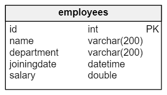
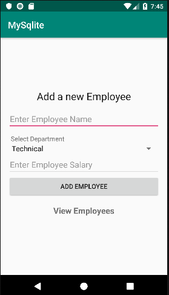
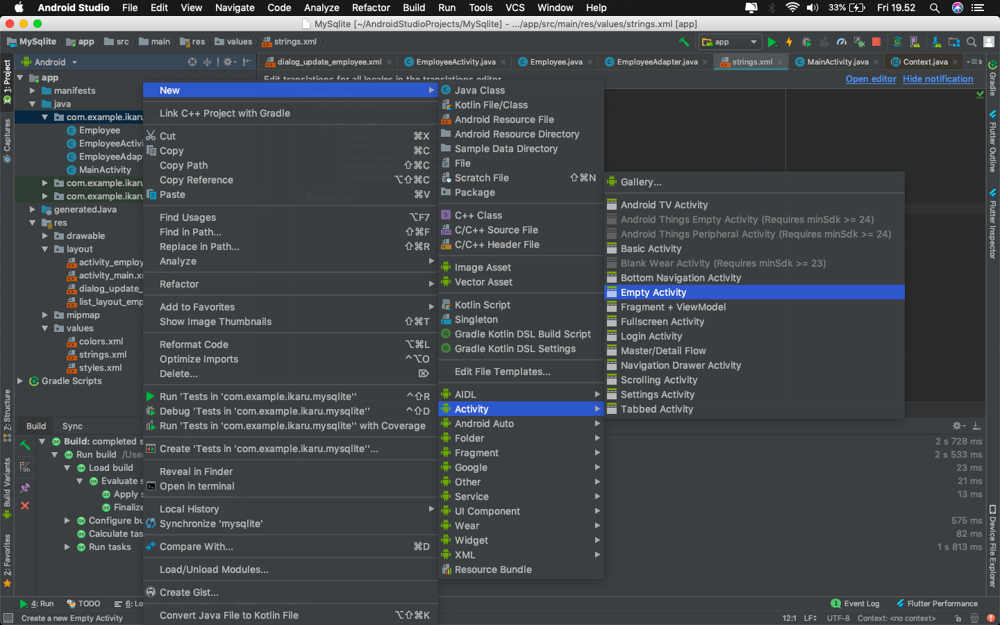
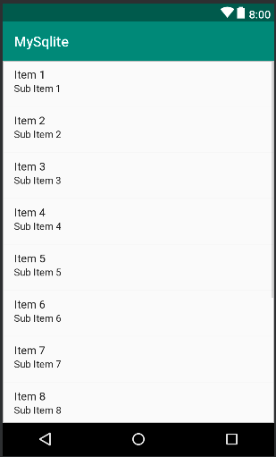
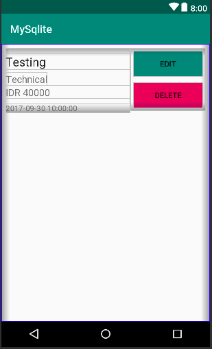
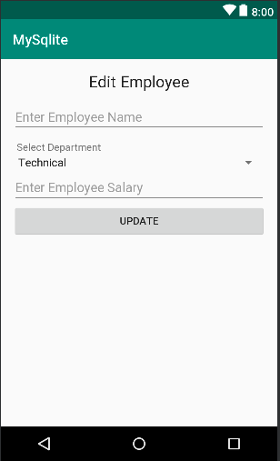
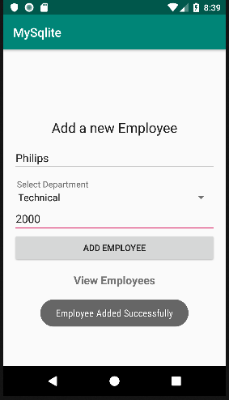
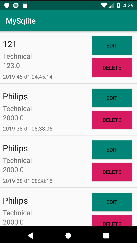
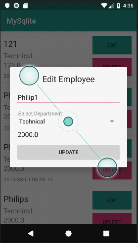
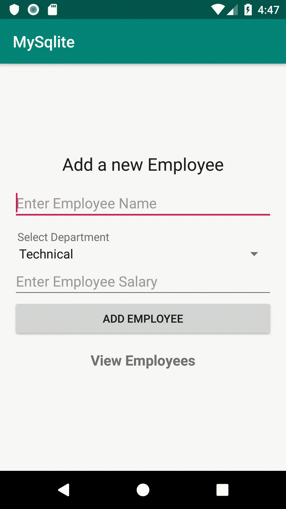

# Operasi CRUD dengan menggunakan SQLite pada Android

## Apa itu SQLite ?
SQLite adalah perpustakaan perangkat lunak yang menerapkan engine database SQL secara mandiri, tanpa memerlukan server, tanpa perlu melakukan konfigurasi, dan bersifat transaksional.

## Apa itu CRUD ?
CRUD adalah singkatan dari **Create Read Update Delete** , yang sering digunakan pada aplikasi-aplikasi pengolahan data yang kebanyakan mengguanakan fungsi CRUD didalamnya . Fungsi ini digunakan untuk menambahkan data, menghapus data, serta mengupdate data.

## 1. Kita membuat database employee
Pertama yang kita butuhkan adalah Struktur Database . Sebagai contoh saat ini kita membuat aplikasi untuk mendaftarkan pegawai , nah sebagai contoh kita hanya butuh satu tabel yaitu table employees atau karyawan. Saya menggunakan struktur tabel sebagai berikut :



## 2. Membuat Tampilan 

### 2.1 Tampilan untuk mendaftarkan karyawan baru
-  Kita akan membuat tampilan seperti ini 



- Seperti yang kamu lihat, kita memiliki EditText, Button, Spinner dan beberapa TextViews. Untuk membuat tampilan seperti diatas kita memerlukan kode XML . Kamu hanya perlu melakukan copy paste kepada **activity_main.xml**
```xml
<?xml version="1.0" encoding="utf-8"?>
<RelativeLayout xmlns:android="http://schemas.android.com/apk/res/android"
    xmlns:app="http://schemas.android.com/apk/res-auto"
    xmlns:tools="http://schemas.android.com/tools"
    android:layout_width="match_parent"
    android:layout_height="match_parent"
    tools:context=".MainActivity">


    <LinearLayout
        android:layout_width="match_parent"
        android:layout_height="wrap_content"
        android:layout_centerVertical="true"
        android:orientation="vertical"
        android:padding="16dp">

        <TextView
            android:layout_width="match_parent"
            android:layout_height="wrap_content"
            android:layout_marginBottom="12dp"
            android:text="Add a new Employee"
            android:textAlignment="center"
            android:textAppearance="@style/Base.TextAppearance.AppCompat.Large" />

        <EditText
            android:id="@+id/editTextName"
            android:layout_width="match_parent"
            android:layout_height="wrap_content"
            android:hint="Enter Employee Name" />

        <TextView
            android:layout_width="match_parent"
            android:layout_height="wrap_content"
            android:layout_marginTop="10dp"
            android:paddingLeft="6dp"
            android:text="Select Department" />

        <Spinner
            android:id="@+id/spinnerDepartment"
            android:layout_width="match_parent"
            android:layout_height="wrap_content"
            android:entries="@array/departments" />

        <EditText
            android:id="@+id/editTextSalary"
            android:layout_width="match_parent"
            android:layout_height="wrap_content"
            android:digits="0123456789"
            android:hint="Enter Employee Salary"
            android:inputType="number" />

        <Button
            android:id="@+id/buttonAddEmployee"
            android:layout_width="match_parent"
            android:layout_height="wrap_content"
            android:text="Add Employee" />

        <TextView
            android:id="@+id/textViewViewEmployees"
            android:layout_width="match_parent"
            android:layout_height="wrap_content"
            android:padding="16dp"
            android:text="View Employees"
            android:textAlignment="center"
            android:textAppearance="@style/Base.TextAppearance.AppCompat.Medium"
            android:textStyle="bold" />

    </LinearLayout>

</RelativeLayout>
```
- Untuk spinner yang kita gunakan diatas , kita perlu mendefinisikan Array sebagai isi yang ada di dalam spinner tersebut yang terletak pada **res->values->strings.xml**
sesuaikan code kamu menjadi seperti berikut
```xml
<resources>
    <string name="app_name">MySqlite</string>

    <array name="departments">
        <item>Technical</item>
        <item>Support</item>
        <item>Research and Development</item>
        <item>Marketing</item>
        <item>Human Resource</item>
    </array>
</resources>
```
### 2.2 Tampilan untuk menampilkan semua list karyawan 

- Sekarang setelah menyimpan karyawan ke database, kita juga perlu melihat semua karyawan yang tersimpan dari database. Untuk ini, kita bisa menggunakan ListView.

- Jadi kita memerlukan EmptyActivity yang kita beri nama **EmployeeActivity** . Dengan cara sebagai berikut : 



- Untuk tampilan kali ini kita dapat menggunakan desain sebagai berikut : 


- Kita hanya perlu menambahkan **ListView** didalam file xml yang telah kita buat (**Activity_employee.xml**)
```xml
<?xml version="1.0" encoding="utf-8"?>
<RelativeLayout xmlns:android="http://schemas.android.com/apk/res/android"
    xmlns:app="http://schemas.android.com/apk/res-auto"
    xmlns:tools="http://schemas.android.com/tools"
    android:layout_width="match_parent"
    android:layout_height="match_parent"
    tools:context=".EmployeeActivity">

    <ListView
        android:id="@+id/listViewEmployees"
        android:layout_width="match_parent"
        android:layout_height="wrap_content"></ListView>

</RelativeLayout>
```
- Selanjutnya kita perlu menambahkan tampilan untuk ListView kita . Jadi , kita memerlukan satu file lagi yaitu **list_layout_employee.xml** . Kita dapat membuatnya dengan cara berikut : 

- Lalu kita tuliskan kode sebagai berikut : 
```xml
<?xml version="1.0" encoding="utf-8"?>
<LinearLayout
    xmlns:android="http://schemas.android.com/apk/res/android"
    android:layout_width="match_parent"
    android:layout_height="match_parent"
    android:orientation="horizontal"
    android:padding="8dp">

    <LinearLayout
        android:layout_width="230dp"
        android:layout_height="wrap_content"
        android:orientation="vertical">

        <TextView
            android:id="@+id/textViewName"
            android:layout_width="match_parent"
            android:layout_height="wrap_content"
            android:layout_marginBottom="5dp"
            android:layout_marginTop="10dp"
            android:text="Testing"
            android:textAppearance="@style/Base.TextAppearance.AppCompat.Large" />

        <TextView
            android:id="@+id/textViewDepartment"
            android:layout_width="wrap_content"
            android:layout_height="wrap_content"
            android:text="Technical"
            android:textAppearance="@style/Base.TextAppearance.AppCompat.Medium" />

        <TextView
            android:id="@+id/textViewSalary"
            android:layout_width="match_parent"
            android:layout_height="wrap_content"
            android:text="IDR 40000"
            android:textAppearance="@style/Base.TextAppearance.AppCompat.Medium" />

        <TextView
            android:id="@+id/textViewJoiningDate"
            android:layout_width="match_parent"
            android:layout_height="wrap_content"
            android:layout_marginTop="8dp"
            android:text="2017-09-30 10:00:00" />

    </LinearLayout>

    <LinearLayout
        android:layout_width="match_parent"
        android:layout_height="wrap_content"
        android:orientation="vertical">

        <Button
            android:id="@+id/buttonEditEmployee"
            android:layout_width="match_parent"
            android:layout_height="wrap_content"
            android:layout_margin="5dp"
            android:background="@color/colorPrimary"
            android:text="Edit" />

        <Button
            android:id="@+id/buttonDeleteEmployee"
            android:layout_width="match_parent"
            android:layout_height="wrap_content"
            android:layout_margin="5dp"
            android:background="@color/colorAccent"
            android:text="Delete" />

    </LinearLayout>
</LinearLayout>
```
- Kode diatas akan menghasilkan tampilan sebagai berikut :


### 2.3 Tampilan update Karyawan
- Kita perlu membuat xml layout lagi seperti yang sudah dijelaskan diatas yang kita beri nama **dialog_update_employee.xml**

```xml
<?xml version="1.0" encoding="utf-8"?>
<LinearLayout xmlns:android="http://schemas.android.com/apk/res/android"
    android:layout_width="match_parent"
    android:layout_height="match_parent"
    android:orientation="vertical"
    android:padding="16dp">
 
    <TextView
        android:layout_width="match_parent"
        android:layout_height="wrap_content"
        android:layout_marginBottom="12dp"
        android:text="Edit Employee"
        android:textAlignment="center"
        android:textAppearance="@style/Base.TextAppearance.AppCompat.Large" />
 
    <EditText
        android:id="@+id/editTextName"
        android:layout_width="match_parent"
        android:layout_height="wrap_content"
        android:hint="Enter Employee Name" />
 
    <TextView
        android:layout_width="match_parent"
        android:layout_height="wrap_content"
        android:layout_marginTop="10dp"
        android:paddingLeft="6dp"
        android:text="Select Department" />
 
    <Spinner
        android:id="@+id/spinnerDepartment"
        android:layout_width="match_parent"
        android:layout_height="wrap_content"
        android:entries="@array/departments" />
 
    <EditText
        android:id="@+id/editTextSalary"
        android:layout_width="match_parent"
        android:layout_height="wrap_content"
        android:digits="0123456789"
        android:hint="Enter Employee Salary"
        android:inputType="number" />
 
    <Button
        android:id="@+id/buttonUpdateEmployee"
        android:layout_width="match_parent"
        android:layout_height="wrap_content"
        android:text="Update" />
 
</LinearLayout>
```

- Kode diatas akan menghasilkan tampilan sebagai berikut 


- Kita tidak memerlukan desain terpisah untuk menghapus karyawan karena kita akan melakukannya dari button yang kita buat di List.
- Jadi kita telah selesai membuat semua desain tampilan sekarang waktu kita untuk melakukan coding pada file - file java

## 3. Coding the Application

### 3.1 Menambah Karyawan
- Jadi kita akan melakukan penambah karyawan didalam **MainActivity.java** , tuliskan kode berikut : 
```java
import android.content.Intent;
import android.database.sqlite.SQLiteDatabase;
import android.support.v7.app.AppCompatActivity;
import android.os.Bundle;
import android.view.View;
import android.widget.EditText;
import android.widget.Spinner;
import android.widget.TextView;
 
public class MainActivity extends AppCompatActivity implements View.OnClickListener {
 
    public static final String DATABASE_NAME = "myemployeedatabase";
 
    TextView textViewViewEmployees;
    EditText editTextName, editTextSalary;
    Spinner spinnerDepartment;
 
    SQLiteDatabase mDatabase;
 
    @Override
    protected void onCreate(Bundle savedInstanceState) {
        super.onCreate(savedInstanceState);
        setContentView(R.layout.activity_main);
 
        textViewViewEmployees = (TextView) findViewById(R.id.textViewViewEmployees);
        editTextName = (EditText) findViewById(R.id.editTextName);
        editTextSalary = (EditText) findViewById(R.id.editTextSalary);
        spinnerDepartment = (Spinner) findViewById(R.id.spinnerDepartment);
 
        findViewById(R.id.buttonAddEmployee).setOnClickListener(this);
        textViewViewEmployees.setOnClickListener(this);
 
        //untuk membuat database
        mDatabase = openOrCreateDatabase(DATABASE_NAME, MODE_PRIVATE, null);
        createEmployeeTable();
    }

    //digunakan untuk membuat tabel employee
     private void createEmployeeTable() {

    }
    
 
    //method ini akan melakukan validasi kepada name dan salary
    private boolean inputsAreCorrect(String name, String salary) {
        if (name.isEmpty()) {
            editTextName.setError("Please enter a name");
            editTextName.requestFocus();
            return false;
        }
 
        if (salary.isEmpty() || Integer.parseInt(salary) <= 0) {
            editTextSalary.setError("Please enter salary");
            editTextSalary.requestFocus();
            return false;
        }
        return true;
    }
 
    //Melakukan penambahan karyawan
    private void addEmployee() {
 
    }

 
    @Override
    public void onClick(View view) {
        switch (view.getId()) {
            case R.id.buttonAddEmployee:
 
                addEmployee();
 
                break;
            case R.id.textViewViewEmployees:
 
                startActivity(new Intent(this, EmployeeActivity.class));
 
                break;
        }
    }
}
```

- Sekarang kita perlu membuat method yang digunakan untuk membuat tabel Employee . Dan kita perlu melakukan hal tersebut di dalam method **createEmployeeTable()**
```java
    //Method ini digunakan untuk membuat tabel
    //Karena kita perlu memanggil ini setiap kita membuka aplikasi
    //sudah ditambahkan IF NOT EXISTS di dalam SQL
    //jadi tidak akan membuat tabel baru ketika ada tabelnya telah dibuat 
    private void createEmployeeTable() {
        mDatabase.execSQL(
                "CREATE TABLE IF NOT EXISTS employees (\n" +
                        "    id INTEGER NOT NULL CONSTRAINT employees_pk PRIMARY KEY AUTOINCREMENT,\n" +
                        "    name varchar(200) NOT NULL,\n" +
                        "    department varchar(200) NOT NULL,\n" +
                        "    joiningdate datetime NOT NULL,\n" +
                        "    salary double NOT NULL\n" +
                        ");"
        );
    }
```
- Sekarang kita sudah punya Database dan Tabelnya . Sekarang kita hanya perlu melakukan insert kepada tabel tersebut , yang kita bisa lakukan didalam method **addEmployee()**

```java
  private void addEmployee() {
 
        String name = editTextName.getText().toString().trim();
        String salary = editTextSalary.getText().toString().trim();
        String dept = spinnerDepartment.getSelectedItem().toString();
 
        //mendapatkan waktu sekarang sebagai joiningDate
        Calendar cal = Calendar.getInstance();
        SimpleDateFormat sdf = new SimpleDateFormat("yyyy-mm-dd hh:mm:ss");
        String joiningDate = sdf.format(cal.getTime());
 
        //melakukan validasi input
        if (inputsAreCorrect(name, salary)) {
 
            String insertSQL = "INSERT INTO employees \n" +
                    "(name, department, joiningdate, salary)\n" +
                    "VALUES \n" +
                    "(?, ?, ?, ?);";
            
            //using the same method execsql for inserting values
            //this time it has two parameters
            //first is the sql string and second is the parameters that is to be binded with the query
            mDatabase.execSQL(insertSQL, new String[]{name, dept, joiningDate, salary});
 
            Toast.makeText(this, "Employee Added Successfully", Toast.LENGTH_SHORT).show();
        }
    }
```

- Sekarang kamu dapat melakukan Create pada aplikasi tersebut


- Sekarang waktunya move on ke Read Operation

### 3.2 Melihat semua karyawan
- Kita akan melakukan operasi ini dalam **EmployeeActivity.java** dengan bantuan **CustomAdapter** dan **ListView**
 - Kita akan membuat java dengan nama class **Employee.java**
 ```java
public class Employee {
    int id;
    String name, dept, joiningDate;
    double salary;
 
    public Employee(int id, String name, String dept, String joiningDate, double salary) {
        this.id = id;
        this.name = name;
        this.dept = dept;
        this.joiningDate = joiningDate;
        this.salary = salary;
    }
 
    public int getId() {
        return id;
    }
 
    public String getName() {
        return name;
    }
 
    public String getDept() {
        return dept;
    }
 
    public String getJoiningDate() {
        return joiningDate;
    }
 
    public double getSalary() {
        return salary;
    }
}
 ```

 - Sekarang kita perlu membuat kelas adapter untuk ListView. Buatlah nama kelas **EmployeeAdapter** 
 ```java
  
import android.content.Context;
import android.database.Cursor;
import android.database.sqlite.SQLiteDatabase;
import android.support.annotation.NonNull;
import android.support.annotation.Nullable;
import android.support.v7.app.AlertDialog;
import android.view.LayoutInflater;
import android.view.View;
import android.view.ViewGroup;
import android.widget.ArrayAdapter;
import android.widget.Button;
import android.widget.EditText;
import android.widget.Spinner;
import android.widget.TextView;
import android.widget.Toast;
 
import java.util.List;
 
 
public class EmployeeAdapter extends ArrayAdapter<Employee> {
 
    Context mCtx;
    int listLayoutRes;
    List<Employee> employeeList;
    SQLiteDatabase mDatabase;
 
    public EmployeeAdapter(Context mCtx, int listLayoutRes, List<Employee> employeeList, SQLiteDatabase mDatabase) {
        super(mCtx, listLayoutRes, employeeList);
 
        this.mCtx = mCtx;
        this.listLayoutRes = listLayoutRes;
        this.employeeList = employeeList;
        this.mDatabase = mDatabase;
    }
 
    @NonNull
    @Override
    public View getView(int position, @Nullable View convertView, @NonNull ViewGroup parent) {
        LayoutInflater inflater = LayoutInflater.from(mCtx);
        View view = inflater.inflate(listLayoutRes, null);
 
        //getting employee of the specified position
        Employee employee = employeeList.get(position);
 
 
        //getting views
        TextView textViewName = view.findViewById(R.id.textViewName);
        TextView textViewDept = view.findViewById(R.id.textViewDepartment);
        TextView textViewSalary = view.findViewById(R.id.textViewSalary);
        TextView textViewJoiningDate = view.findViewById(R.id.textViewJoiningDate);
 
        //adding data to views
        textViewName.setText(employee.getName());
        textViewDept.setText(employee.getDept());
        textViewSalary.setText(String.valueOf(employee.getSalary()));
        textViewJoiningDate.setText(employee.getJoiningDate());
 
        //we will use these buttons later for update and delete operation
        Button buttonDelete = view.findViewById(R.id.buttonDeleteEmployee);
        Button buttonEdit = view.findViewById(R.id.buttonEditEmployee);
 
        return view;
    }
}

 ```

- Sekarang kita dapat mengambil semua data karyawan untuk ditampilkan didalam ListView

- Sekarang tuliskan kode berikut didalam **EmployeeActivity.java** 
```java
import android.database.Cursor;
import android.database.sqlite.SQLiteDatabase;
import android.os.Bundle;
import android.support.v7.app.AppCompatActivity;
import android.widget.ListView;
 
import java.util.ArrayList;
import java.util.List;
 
public class EmployeeActivity extends AppCompatActivity {
 
    List<Employee> employeeList;
    SQLiteDatabase mDatabase;
    ListView listViewEmployees;
    EmployeeAdapter adapter;
 
    @Override
    protected void onCreate(Bundle savedInstanceState) {
        super.onCreate(savedInstanceState);
        setContentView(R.layout.activity_employee);
 
        listViewEmployees = (ListView) findViewById(R.id.listViewEmployees);
        employeeList = new ArrayList<>();
 
        //opening the database 
        mDatabase = openOrCreateDatabase(MainActivity.DATABASE_NAME, MODE_PRIVATE, null);
        
        //this method will display the employees in the list
        showEmployeesFromDatabase();
    }
 
    private void showEmployeesFromDatabase() {
        
        //we used rawQuery(sql, selectionargs) for fetching all the employees
        Cursor cursorEmployees = mDatabase.rawQuery("SELECT * FROM employees", null);
 
        //if the cursor has some data
        if (cursorEmployees.moveToFirst()) {
            //looping through all the records
            do {
                //pushing each record in the employee list
                employeeList.add(new Employee(
                        cursorEmployees.getInt(0),
                        cursorEmployees.getString(1),
                        cursorEmployees.getString(2),
                        cursorEmployees.getString(3),
                        cursorEmployees.getDouble(4)
                ));
            } while (cursorEmployees.moveToNext());
        }
        //closing the cursor
        cursorEmployees.close();
        
        //creating the adapter object
        adapter = new EmployeeAdapter(this, R.layout.list_layout_employee, employeeList, mDatabase);
        
        //adding the adapter to listview
        listViewEmployees.setAdapter(adapter);
    }
 
}
```

- Sekarang cobalah untuk operasi Read



### 3.3 Melakukan Update Karyawan
- Setelah kita membuat operasi Create dan Read sekarang kita hanya perlu membuat operasi Update dan Delete

- Untuk melakukan operasi Update , kita dapat melakukkannya di dalam **EmployeeAdapter.java** , kita hanya perlu menambahkan dua buah method yang akan kita beri nama **updateEmployee()** dan **reloadEmployeesFromDatabase()**

```java
  private void updateEmployee(final Employee employee) {
        final AlertDialog.Builder builder = new AlertDialog.Builder(mCtx);
 
        LayoutInflater inflater = LayoutInflater.from(mCtx);
        View view = inflater.inflate(R.layout.dialog_update_employee, null);
        builder.setView(view);
 
 
        final EditText editTextName = view.findViewById(R.id.editTextName);
        final EditText editTextSalary = view.findViewById(R.id.editTextSalary);
        final Spinner spinnerDepartment = view.findViewById(R.id.spinnerDepartment);
 
        editTextName.setText(employee.getName());
        editTextSalary.setText(String.valueOf(employee.getSalary()));
 
        final AlertDialog dialog = builder.create();
        dialog.show();
 
        view.findViewById(R.id.buttonUpdateEmployee).setOnClickListener(new View.OnClickListener() {
            @Override
            public void onClick(View view) {
                String name = editTextName.getText().toString().trim();
                String salary = editTextSalary.getText().toString().trim();
                String dept = spinnerDepartment.getSelectedItem().toString();
 
                if (name.isEmpty()) {
                    editTextName.setError("Name can't be blank");
                    editTextName.requestFocus();
                    return;
                }
 
                if (salary.isEmpty()) {
                    editTextSalary.setError("Salary can't be blank");
                    editTextSalary.requestFocus();
                    return;
                }
 
                String sql = "UPDATE employees \n" +
                        "SET name = ?, \n" +
                        "department = ?, \n" +
                        "salary = ? \n" +
                        "WHERE id = ?;\n";
 
                mDatabase.execSQL(sql, new String[]{name, dept, salary, String.valueOf(employee.getId())});
                Toast.makeText(mCtx, "Employee Updated", Toast.LENGTH_SHORT).show();
                reloadEmployeesFromDatabase();
 
                dialog.dismiss();
            }
        });
 
 
    }
 
    private void reloadEmployeesFromDatabase() {
        Cursor cursorEmployees = mDatabase.rawQuery("SELECT * FROM employees", null);
        if (cursorEmployees.moveToFirst()) {
            employeeList.clear();
            do {
                employeeList.add(new Employee(
                        cursorEmployees.getInt(0),
                        cursorEmployees.getString(1),
                        cursorEmployees.getString(2),
                        cursorEmployees.getString(3),
                        cursorEmployees.getDouble(4)
                ));
            } while (cursorEmployees.moveToNext());
        }
        cursorEmployees.close();
        notifyDataSetChanged();
    }
```

- Selanjutnya kita perlu menambahkan clicklistener kepada button yang ada di method **getView()**

```java
public View getView(int position, @Nullable View convertView, @NonNull ViewGroup parent) {
        LayoutInflater inflater = LayoutInflater.from(mCtx);
        View view = inflater.inflate(listLayoutRes, null);
        
        final Employee employee = employeeList.get(position);
 
        
        TextView textViewName = view.findViewById(R.id.textViewName);
        TextView textViewDept = view.findViewById(R.id.textViewDepartment);
        TextView textViewSalary = view.findViewById(R.id.textViewSalary);
        TextView textViewJoiningDate = view.findViewById(R.id.textViewJoiningDate);
 
        
        textViewName.setText(employee.getName());
        textViewDept.setText(employee.getDept());
        textViewSalary.setText(String.valueOf(employee.getSalary()));
        textViewJoiningDate.setText(employee.getJoiningDate());
 
        
        Button buttonDelete = view.findViewById(R.id.buttonDeleteEmployee);
        Button buttonEdit = view.findViewById(R.id.buttonEditEmployee);
 
        //adding a clicklistener to button 
        buttonEdit.setOnClickListener(new View.OnClickListener() {
            @Override
            public void onClick(View view) {
                updateEmployee(employee);
            }
        });
 
        return view;
    }
```

- Sekarang kamu dapat melakukan tes pada operasi Update



### 3.4 Melakukan Delete Karyawan

- Kita telah membuat operasi Create , Read dan Update . Sekarang untuk akhir kita perlu membuat Delete untuk menyelesaikan tutorial ini 

- Untuk membuat operasi Delete hanya perlu mengedit kelas **EmployeeAdapter** saja . Ubahlah method **getView()** menjadi seperti berikut : 
```java
 @NonNull
    @Override
    public View getView(int position, @Nullable View convertView, @NonNull ViewGroup parent) {
        LayoutInflater inflater = LayoutInflater.from(mCtx);
        View view = inflater.inflate(listLayoutRes, null);
 
        final Employee employee = employeeList.get(position);
 
 
        TextView textViewName = view.findViewById(R.id.textViewName);
        TextView textViewDept = view.findViewById(R.id.textViewDepartment);
        TextView textViewSalary = view.findViewById(R.id.textViewSalary);
        TextView textViewJoiningDate = view.findViewById(R.id.textViewJoiningDate);
 
 
        textViewName.setText(employee.getName());
        textViewDept.setText(employee.getDept());
        textViewSalary.setText(String.valueOf(employee.getSalary()));
        textViewJoiningDate.setText(employee.getJoiningDate());
 
 
        Button buttonDelete = view.findViewById(R.id.buttonDeleteEmployee);
        Button buttonEdit = view.findViewById(R.id.buttonEditEmployee);
 
        //adding a clicklistener to button
        buttonEdit.setOnClickListener(new View.OnClickListener() {
            @Override
            public void onClick(View view) {
                updateEmployee(employee);
            }
        });
 
        //the delete operation
        buttonDelete.setOnClickListener(new View.OnClickListener() {
            @Override
            public void onClick(View view) {
                AlertDialog.Builder builder = new AlertDialog.Builder(mCtx);
                builder.setTitle("Are you sure?");
                builder.setPositiveButton("Yes", new DialogInterface.OnClickListener() {
                    @Override
                    public void onClick(DialogInterface dialogInterface, int i) {
                        String sql = "DELETE FROM employees WHERE id = ?";
                        mDatabase.execSQL(sql, new Integer[]{employee.getId()});
                        reloadEmployeesFromDatabase();
                    }
                });
                builder.setNegativeButton("Cancel", new DialogInterface.OnClickListener() {
                    @Override
                    public void onClick(DialogInterface dialogInterface, int i) {
 
                    }
                });
                AlertDialog dialog = builder.create();
                dialog.show();
            }
        });
 
        return view;
    }
```

- Jadi semuanya telah selesai dan sekarang kamu dapat mencoba semua operasi yang telah kamu buat . Dan hasilnya sebagai berikut

